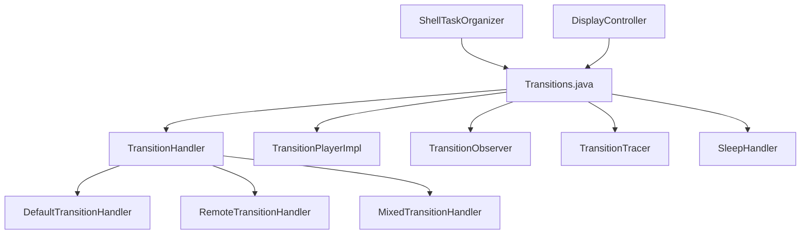
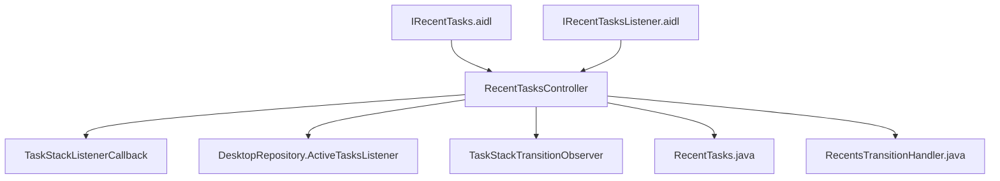
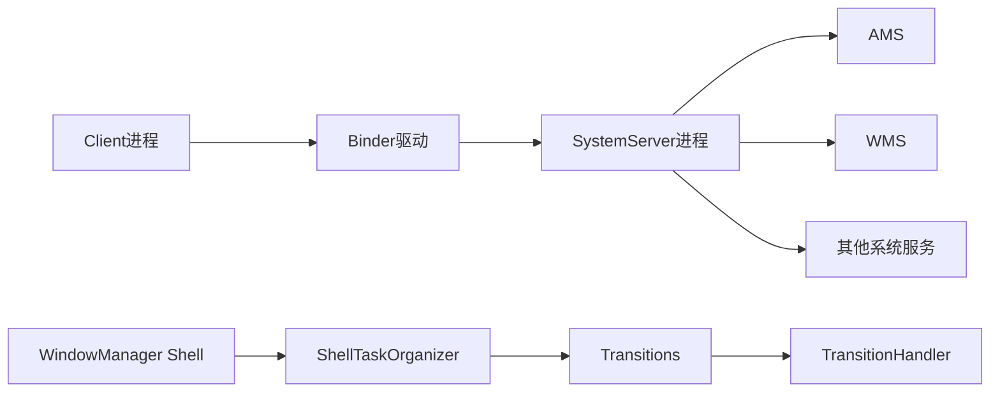
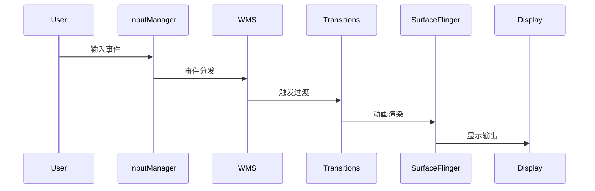

# AOSP Frameworks 项目架构分析

## 项目概述

本项目是基于Android Open Source Project (AOSP) 16的Framework层源码分析项目，主要关注Input事件、显示流程、AMS、WMS、SurfaceFlinger、Handler、Binder、系统Service、WindowManager、SystemUI、Launcher等核心模块的源码分析和文档编写。

## 项目结构分析

### 1. 项目根目录结构

```
AOSP_Frameworks/
├── base/                    # Framework核心模块
│   ├── apex/               # APEX模块
│   ├── api/                # API定义
│   ├── boot/               # 启动相关
│   ├── cmds/               # 系统命令
│   ├── config/             # 配置管理
│   ├── core/               # 核心Framework
│   ├── data/               # 数据资源
│   ├── docs/               # 文档
│   ├── drm/                # DRM相关
│   ├── graphics/           # 图形系统
│   ├── identity/           # 身份认证
│   ├── keystore/           # 密钥存储
│   ├── libs/               # 核心库
│   │   └── WindowManager/  # WindowManager Shell
│   ├── location/           # 位置服务
│   ├── media/              # 媒体框架
│   ├── mime/               # MIME类型
│   ├── mms/                # 彩信服务
│   ├── native/             # Native层
│   ├── nfc-extras/         # NFC扩展
│   ├── obex/               # OBEX协议
│   ├── omapi/              # OMAPI
│   ├── packages/           # 系统应用包
│   │   └── SystemUI/       # SystemUI应用
│   ├── proto/              # Protocol Buffers
│   ├── ravenwood/          # 测试框架
│   ├── rs/                 # RenderScript
│   ├── sax/                # SAX解析器
│   ├── services/           # 系统服务
│   ├── startop/            # 启动优化
│   ├── telecomm/           # 通信服务
│   ├── telephony/          # 电话服务
│   ├── test-base/          # 测试基础
│   ├── test-mock/          # Mock测试
│   ├── tests/              # 测试用例
│   ├── tools/              # 开发工具
│   └── wifi/               # WiFi服务
├── docs/                   # 分析文档
├── media/                  # 媒体资源
├── native/                 # Native层源码
└── README.md               # 项目说明
```

### 2. 核心模块识别

#### 2.1 WindowManager Shell 模块

**位置**: `base/libs/WindowManager/Shell/`

**核心组件**:
- **Transition系统** (`transition/`): 负责窗口过渡动画管理
- **Recent Tasks** (`recents/`): 最近任务管理
- **Bubbles** (`bubbles/`): 气泡窗口管理
- **Back Gesture** (`back/`): 返回手势处理
- **Split Screen** (`splitscreen/`): 分屏功能

#### 2.2 SystemUI 模块

**位置**: `base/packages/SystemUI/`

**核心功能**:
- 状态栏管理
- 通知系统
- 快捷设置面板
- 锁屏界面
- 音量控制

#### 2.3 Framework 核心模块

**位置**: `base/core/java/android/`

**核心组件**:
- ActivityManagerService (AMS)
- WindowManagerService (WMS)
- InputManagerService
- DisplayManagerService
- PowerManagerService

## 核心架构分析

### 3. WindowManager Shell 架构

#### 3.1 Transition 系统架构



**核心组件职责**:

1. **Transitions.java** - 过渡动画总控制器
   - 管理过渡动画的生命周期
   - 协调多个TransitionHandler
   - 处理动画队列和同步

2. **TransitionHandler** - 过渡处理器接口
   - 定义过渡动画处理规范
   - 支持自定义过渡动画实现

3. **DefaultTransitionHandler** - 默认过渡处理器
   - 处理标准窗口过渡动画
   - 支持打开、关闭、切换等基本过渡

#### 3.2 Recent Tasks 架构



**核心功能**:
- 最近任务列表管理
- 任务快照生成和缓存
- 任务切换动画协调
- 多用户任务隔离

### 4. 系统服务架构

#### 4.1 Binder 通信架构



#### 4.2 事件处理流程



## 关键源码分析

### 5. Transitions.java 核心分析

#### 5.1 过渡动画生命周期管理

```java
// 过渡状态定义
public class Transitions {
    // 过渡状态：PENDING -> READY -> ACTIVE -> FINISHED
    static final int STATE_PENDING = 0;
    static final int STATE_READY = 1;
    static final int STATE_ACTIVE = 2;
    static final int STATE_FINISHED = 3;
    
    // 过渡类型定义
    public static final int TRANSIT_OPEN = 1;
    public static final int TRANSIT_CLOSE = 2;
    public static final int TRANSIT_TO_FRONT = 6;
    public static final int TRANSIT_TO_BACK = 7;
}
```

#### 5.2 多处理器协调机制

```java
// 处理器优先级队列
private final ArrayList<TransitionHandler> mHandlers = new ArrayList<>();

// 过渡分发逻辑
private boolean dispatchTransition(TransitionInfo info, WindowContainerTransaction wct) {
    for (TransitionHandler handler : mHandlers) {
        if (handler.startAnimation(info, wct)) {
            return true;
        }
    }
    return false;
}
```

### 6. RecentTasksController 核心分析

#### 6.1 任务缓存机制

```java
public class RecentTasksController {
    // 任务缓存
    private final List<RecentTaskInfo> mRecentTasks = new ArrayList<>();
    private final Map<Integer, TaskInfo> mRunningTasks = new HashMap<>();
    
    // 任务分组管理
    private final List<GroupedTaskInfo> mGroupedTasks = new ArrayList<>();
}
```

#### 6.2 任务状态监听

```java
// 实现TaskStackListenerCallback接口
@Override
public void onTaskStackChanged() {
    // 任务栈变化时更新缓存
    updateRecentTasksList();
}

@Override
public void onTaskCreated(int taskId, ComponentName componentName) {
    // 新任务创建处理
    handleTaskCreated(taskId, componentName);
}
```

## 性能优化分析

### 7. 内存优化策略

#### 7.1 任务快照缓存
- 使用LRU缓存策略管理任务快照
- 动态调整缓存大小基于内存压力
- 支持按优先级清理缓存

#### 7.2 动画资源管理
- 动画Surface的复用机制
- 纹理和位图的对象池
- 过渡动画的预加载策略

### 8. 性能监控指标

#### 8.1 过渡动画性能
- 动画启动延迟
- 帧率稳定性
- 内存使用峰值

#### 8.2 任务管理性能
- 任务切换响应时间
- 快照生成耗时
- 缓存命中率

## 架构设计模式分析

### 9. 设计模式应用

#### 9.1 观察者模式 (Observer Pattern)
```java
// TransitionObserver接口
public interface TransitionObserver {
    void onTransitionStarting(IBinder transition);
    void onTransitionFinished(IBinder transition);
}

// 在Transitions中管理观察者
private final ArrayList<TransitionObserver> mObservers = new ArrayList<>();
```

#### 9.2 策略模式 (Strategy Pattern)
```java
// TransitionHandler作为策略接口
public interface TransitionHandler {
    boolean startAnimation(TransitionInfo info, WindowContainerTransaction wct);
}

// 不同的处理器实现不同策略
public class DefaultTransitionHandler implements TransitionHandler {}
public class RemoteTransitionHandler implements TransitionHandler {}
```

#### 9.3 工厂模式 (Factory Pattern)
```java
// TransitionHandler工厂方法
private TransitionHandler createHandlerForType(int transitionType) {
    switch (transitionType) {
        case TRANSIT_OPEN:
            return new DefaultTransitionHandler();
        case TRANSIT_REMOTE:
            return new RemoteTransitionHandler();
        default:
            return null;
    }
}
```

## 总结

本AOSP Frameworks项目展现了Android系统Framework层的复杂架构设计，特别是在WindowManager Shell模块中实现了高度模块化和可扩展的过渡动画系统。通过分析Transitions和RecentTasksController等核心组件，我们可以看到Android系统在窗口管理、任务调度和动画协调方面的精妙设计。

### 架构亮点
1. **模块化设计**: 各功能模块职责清晰，便于维护和扩展
2. **可扩展性**: 通过接口和观察者模式支持功能扩展
3. **性能优化**: 完善的缓存机制和资源管理策略
4. **稳定性保障**: 异常处理和状态机设计确保系统稳定

### 后续分析方向
1. 深入分析SurfaceFlinger与HWUI的交互机制
2. 研究Binder通信的性能优化策略
3. 探索SystemUI与WindowManager的协同工作
4. 分析多显示器支持架构