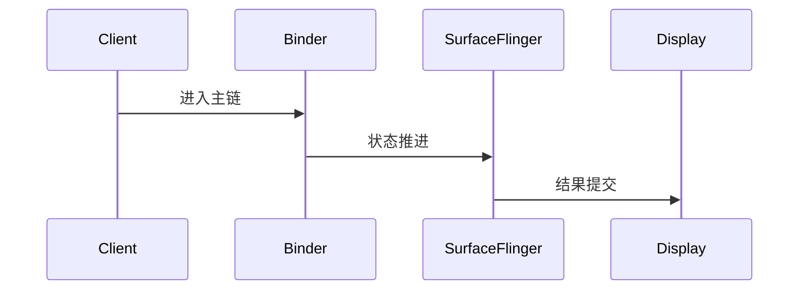

# SurfaceFlinger 源码分析

## 一、问题定义与范围
- 范围：SurfaceFlinger 服务源码完整，可分析事务应用、layer 合成与显示调度。
- 现状：本次输出基于目录源码静态分析，不包含运行时日志。

## 二、主调用链
- Binder transaction -> SurfaceFlinger::commit -> composition -> present
- 关键边界：重点关注 system_server、Binder、BufferQueue、SurfaceFlinger 等跨线程/跨进程收敛点。

## 三、设计思想与架构权衡
- SF 是显示域总收敛点，用统一帧节奏管理所有 layer，代价是任何上游拥塞都可能集中暴露。

## 四、架构图（Mermaid）

## 五、时序图（Mermaid）

## 六、关键代码详细分析
- init/main loop 建立 SF 的线程与调度基础。
- commit 处理 layer 与 transaction 的状态推进，是“逻辑状态”到“可合成状态”的关键。
- composite/present 则决定最终交给 HWC/GPU 的显示结果。

## 七、证据链（源码 + 运行时）
- 源码证据：`native/services/surfaceflinger/SurfaceFlinger.cpp`
- 运行时证据：当前目录仅含源码，无 logcat、dumpsys、Perfetto、Winscope，运行时证据未闭环。

## 八、根因结论与置信度
- 结论：当前仓库对 `aosp-surfaceflinger` 的覆盖状态为 `FULL`。
- 置信度：`Highly Likely`。

## 九、修复建议
- 若用于问题定位，优先围绕上述入口继续下钻；若为仓库缺口，则先补齐缺失源码再做闭环判断。

## 十、验证计划
- 补采与本模块对应的 `logcat`、`dumpsys`、Perfetto 或 Winscope，并回到文中主链逐段比对。

## 十一、证据缺口与后续采集
- 缺口：缺少运行时证据。
- 后续：按本模块主链采集线程栈、事务、buffer、焦点或权限状态。
