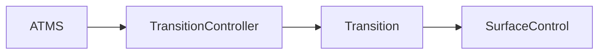
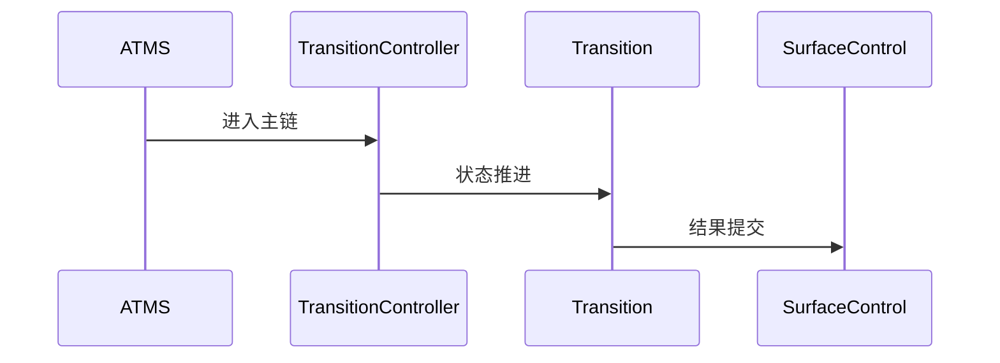

# Transition 源码分析

## 一、问题定义与范围
- 范围：Transition/TransitionController 位于 WMS 主树中，可分析窗口切换与转场编排。
- 现状：本次输出基于目录源码静态分析，不包含运行时日志。

## 二、主调用链
- ATMS visibility change -> TransitionController -> Transition -> SurfaceControl transaction
- 关键边界：重点关注 system_server、Binder、BufferQueue、SurfaceFlinger 等跨线程/跨进程收敛点。

## 三、设计思想与架构权衡
- Transition 把窗口切换从分散的即时变更改为可编排批处理，减少中间态闪烁。

## 四、架构图（Mermaid）

## 五、时序图（Mermaid）

## 六、关键代码详细分析
- TransitionController 决定何时收集和启动一次转场。
- Transition 维护参与对象、状态收集和动画/事务应用边界。
- 黑屏和闪屏常来自参与对象收集不全或提交时序与动画不同步。

## 七、证据链（源码 + 运行时）
- 源码证据：`base/services/core/java/com/android/server/wm/Transition.java`
- 源码证据：`base/services/core/java/com/android/server/wm/TransitionController.java`
- 运行时证据：当前目录仅含源码，无 logcat、dumpsys、Perfetto、Winscope，运行时证据未闭环。

## 八、根因结论与置信度
- 结论：当前仓库对 `aosp-transition` 的覆盖状态为 `FULL`。
- 置信度：`Highly Likely`。

## 九、修复建议
- 若用于问题定位，优先围绕上述入口继续下钻；若为仓库缺口，则先补齐缺失源码再做闭环判断。

## 十、验证计划
- 补采与本模块对应的 `logcat`、`dumpsys`、Perfetto 或 Winscope，并回到文中主链逐段比对。

## 十一、证据缺口与后续采集
- 缺口：缺少运行时证据。
- 后续：按本模块主链采集线程栈、事务、buffer、焦点或权限状态。
