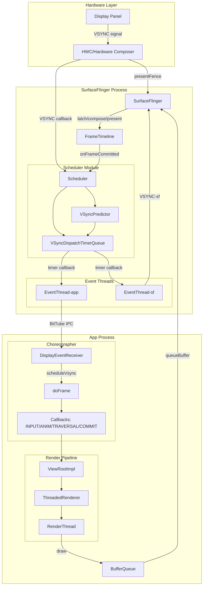
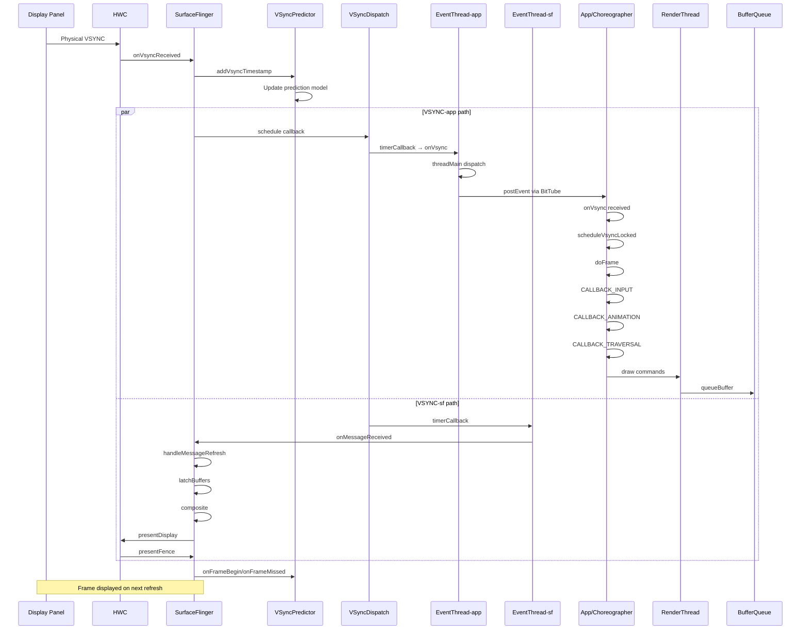

# AOSP VSYNC 源码深度分析

## 一、问题定义与范围

### 现象
VSYNC 是 Android 图形系统的核心时序机制，负责协调整个系统从应用绘制到屏幕显示的节奏。本分析聚焦于 VSYNC 机制的源码实现、跨层调用链、时序模型与关键组件交互。

### 影响范围
- 应用帧率稳定性
- 输入到显示延迟
- 掉帧与卡顿现象
- 高刷新率切换时的时序抖动

### 分析范围
- Android 版本：AOSP 主分支源码
- 核心模块：Choreographer、EventThread、VSyncPredictor、VSyncDispatch、Scheduler
- 涉及层次：App Framework → Native SurfaceFlinger

---

## 二、架构概述

VSYNC 机制本质是一个 **跨层时序控制系统**，解决三个核心问题：
1. **何时开始生产一帧** - App 在 VSYNC-app 驱动下开始 doFrame
2. **何时必须完成这帧** - deadline 机制确保按时提交
3. **何时这帧真正显示** - 通过 present fence 验证

```
┌─────────────────────────────────────────────────────────────────────┐
│                         Display Panel                                │
│                    (物理刷新节奏源)                                    │
└─────────────────────────────────────────────────────────────────────┘
                                │
                                ▼
┌─────────────────────────────────────────────────────────────────────┐
│                      HWC / Composer HAL                              │
│                  (VSYNC source, present fence)                       │
└─────────────────────────────────────────────────────────────────────┘
                                │
                                ▼
┌─────────────────────────────────────────────────────────────────────┐
│                    SurfaceFlinger                                    │
│  ┌──────────────┐  ┌──────────────┐  ┌──────────────┐               │
│  │  Scheduler   │  │EventThread   │  │FrameTimeline │               │
│  │  VSyncPredict│  │(app / sf)    │  │              │               │
│  └──────────────┘  └──────────────┘  └──────────────┘               │
│  ┌──────────────────────────────────────────────────┐               │
│  │           VSyncDispatch (TimerQueue)              │               │
│  └──────────────────────────────────────────────────┘               │
└─────────────────────────────────────────────────────────────────────┘
                    │                           │
                    │ VSYNC-sf                  │ VSYNC-app
                    ▼                           ▼
┌──────────────────────────┐    ┌─────────────────────────────────────┐
│   SurfaceFlinger         │    │           App Process                │
│   (latch/compose/present)│    │  ┌──────────────────────────────┐   │
└──────────────────────────┘    │  │      Choreographer           │   │
                                │  │  ┌────────────────────────┐  │   │
                                │  │  │ doFrame()              │  │   │
                                │  │  │ - INPUT                │  │   │
                                │  │  │ - ANIMATION            │  │   │
                                │  │  │ - TRAVERSAL            │  │   │
                                │  │  │ - COMMIT               │  │   │
                                │  │  └────────────────────────┘  │   │
                                │  │         │                    │   │
                                │  │         ▼                    │   │
                                │  │  ┌────────────────────────┐  │   │
                                │  │  │ ThreadedRenderer      │  │   │
                                │  │  │ (RenderThread/HWUI)   │  │   │
                                │  │  └────────────────────────┘  │   │
                                │  └──────────────────────────────┘   │
                                └─────────────────────────────────────┘
                                            │
                                            ▼
                                ┌─────────────────────────────────────┐
                                │      BufferQueue / BLAST            │
                                │      (queueBuffer)                  │
                                └─────────────────────────────────────┘
                                            │
                                            ▼
                                ┌─────────────────────────────────────┐
                                │          SurfaceFlinger             │
                                │       (latchBuffer → compose)       │
                                └─────────────────────────────────────┘
```

---

## 三、主调用链

### 3.1 VSYNC-app 完整调用链

```
Display Panel VSYNC
    │
    ▼
HWC::presentDisplay (硬件 VSYNC 中断)
    │
    ▼
SurfaceFlinger::onVsyncReceived (hardware VSYNC callback)
    │
    ▼
Scheduler::onVsyncReceived
    │
    ▼
VSyncTracker::addVsyncTimestamp (记录时间戳用于预测)
    │
    ▼
VSyncDispatchTimerQueue::timerCallback
    │
    ▼
EventThread::onVsync (EventThread.cpp:472)
    │
    ├──► 生成 VSync Event (makeVSync)
    │
    ▼
EventThread::threadMain (EventThread.cpp:532)
    │
    ├──► shouldConsumeEvent (判断消费者是否需要此事件)
    │
    ▼
EventThreadConnection::postEvent
    │
    ▼
DisplayEventReceiver::sendEvents (BitTube IPC)
    │
    ▼
[App Process]
    │
    ▼
DisplayEventReceiver::onVsync (JNI callback)
    │
    ▼
Choreographer::FrameDisplayEventReceiver::onVsync (Choreographer.java:1567)
    │
    ▼
Choreographer::scheduleVsyncLocked (Choreographer.java:1270)
    │
    ▼
MessageQueue::postSyncBarrier (同步屏障)
    │
    ▼
Choreographer::FrameDisplayEventReceiver::run (Choreographer.java:1613)
    │
    ▼
Choreographer::doFrame (Choreographer.java:1021)
    │
    ├──► doCallbacks(CALLBACK_INPUT)      (Choreographer.java:1157)
    ├──► doCallbacks(CALLBACK_ANIMATION)  (Choreographer.java:1160)
    ├──► doCallbacks(CALLBACK_INSETS_ANIMATION)
    ├──► doCallbacks(CALLBACK_TRAVERSAL)  (Choreographer.java:1164)
    └──► doCallbacks(CALLBACK_COMMIT)      (Choreographer.java:1166)
    │
    ▼
ViewRootImpl::doTraversal → performTraversals
    │
    ├──► measure
    ├──► layout
    └──► draw
    │
    ▼
ThreadedRenderer::draw (HWUI)
    │
    ▼
RenderThread::queueBuffer
    │
    ▼
[SurfaceFlinger latch/compose/present]
```

### 3.2 VSYNC-sf 调用链

```
VSyncDispatchTimerQueue::timerCallback
    │
    ▼
Scheduler::vsyncCallback
    │
    ▼
SurfaceFlinger::onMessageReceived (MessageQueue)
    │
    ▼
SurfaceFlinger::handleMessageRefresh
    │
    ├──► SurfaceFlinger::preComposition (预合成准备)
    │
    ├──► SurfaceFlinger::latchBuffers (获取各 Layer 的最新 buffer)
    │       │
    │       └──► Layer::latchBufferImpl (Layer.cpp:1475)
    │               │
    │               ├──► 检查 acquire fence
    │               ├─── 检查 buffer 是否 ready
    │               └─── 更新 Layer 状态
    │
    ├──► SurfaceFlinger::commit (提交事务)
    │
    ├──► SurfaceFlinger::composite (合成)
    │       │
    │       ├──► CompositionEngine::present
    │       │       │
    │       │       ├──► HWComposer::validateDisplay
    │       │       └──► HWComposer::presentDisplay
    │       │
    │       └──► 返回 presentFence
    │
    └──► SurfaceFlinger::postComposition (合成后处理)
            │
            └──► FrameTimeline::onFrameCommitted
```

---

## 四、关键源码详细分析

### 4.1 Choreographer.java - 应用层 VSYNC 接收与调度

**文件路径**: `frameworks/base/core/java/android/view/Choreographer.java`

#### 4.1.1 doFrame 核心方法

```java
// Choreographer.java:1021
void doFrame(long frameTimeNanos, int frame,
        DisplayEventReceiver.VsyncEventData vsyncEventData) {
    final long startNanos;
    final long frameIntervalNanos = vsyncEventData.frameInterval;
    final long intendedFrameTimeNanos = frameTimeNanos;
    long offsetFrameTimeNanos = frameTimeNanos;

    // Buffer stuffing recovery 处理
    if (bufferStuffingRecovery()) {
        switch (updateBufferStuffingState(frameTimeNanos, vsyncEventData)) {
            case DELAY_FRAME:
                // 延迟帧处理，等待下一个 VSYNC
                scheduleVsyncLocked();
                return;
        }
    }

    // 计算抖动(jitter)，判断是否错过 VSYNC
    startNanos = System.nanoTime();
    final long jitterNanos = startNanos - frameTimeNanos;
    if (jitterNanos >= frameIntervalNanos) {
        // 重新同步到最近的 VSYNC 时间
        long lastFrameOffset = jitterNanos % frameIntervalNanos;
        frameTimeNanos = startNanos - lastFrameOffset;
        final long skippedFrames = jitterNanos / frameIntervalNanos;
        if (skippedFrames >= SKIPPED_FRAME_WARNING_LIMIT) {
            Log.i(TAG, "Skipped " + skippedFrames + " frames!");
        }
    }

    // 按顺序执行各阶段回调
    mFrameInfo.markInputHandlingStart();
    doCallbacks(Choreographer.CALLBACK_INPUT, frameIntervalNanos);

    mFrameInfo.markAnimationsStart();
    doCallbacks(Choreographer.CALLBACK_ANIMATION, frameIntervalNanos);
    doCallbacks(Choreographer.CALLBACK_INSETS_ANIMATION, frameIntervalNanos);

    mFrameInfo.markPerformTraversalsStart();
    doCallbacks(Choreographer.CALLBACK_TRAVERSAL, frameIntervalNanos);

    doCallbacks(Choreographer.CALLBACK_COMMIT, frameIntervalNanos);
}
```

**设计要点**:
1. **阶段顺序**: INPUT → ANIMATION → INSETS_ANIMATION → TRAVERSAL → COMMIT，确保输入处理在前，绘制在后
2. **Jitter 计算**: 当 `startNanos - frameTimeNanos >= frameIntervalNanos` 时，表示错过了 VSYNC
3. **帧同步**: 通过 `frameTimeNanos = startNanos - lastFrameOffset` 重新对齐到最近的 VSYNC

#### 4.1.2 scheduleVsyncLocked 方法

```java
// Choreographer.java:1270
private void scheduleVsyncLocked() {
    try {
        Trace.traceBegin(Trace.TRACE_TAG_VIEW, "Choreographer#scheduleVsyncLocked");
        mDisplayEventReceiver.scheduleVsync();  // 请求下一个 VSYNC
    } finally {
        Trace.traceEnd(Trace.TRACE_TAG_VIEW);
    }
}
```

**调用时机**: 当有新的帧回调注册但当前没有待处理的 VSYNC 时调用，通过 `DisplayEventReceiver.scheduleVsync()` 向 SurfaceFlinger 请求下一个 VSYNC 事件。

---

### 4.2 EventThread.cpp - VSYNC 事件分发核心

**文件路径**: `frameworks/native/services/surfaceflinger/Scheduler/EventThread.cpp`

#### 4.2.1 onVsync 回调入口

```cpp
// EventThread.cpp:472
void EventThread::onVsync(nsecs_t vsyncTime, nsecs_t wakeupTime, nsecs_t readyTime) {
    std::lock_guard<std::mutex> lock(mMutex);
    mLastVsyncCallbackTime = TimePoint::fromNs(vsyncTime);

    LOG_FATAL_IF(!mVSyncState);
    mVsyncTracer = (mVsyncTracer + 1) % 2;
    mPendingEvents.push_back(makeVSync(mVsyncSchedule->getPhysicalDisplayId(), wakeupTime,
                                       ++mVSyncState->count, vsyncTime, readyTime));
    mCondition.notify_all();  // 唤醒 threadMain 处理事件
}
```

**设计要点**:
- `vsyncTime`: 硬件 VSYNC 时间戳
- `wakeupTime`: 应该被唤醒处理的时间
- `readyTime`: deadline 时间，必须在此时之前准备好
- 通过 `mCondition.notify_all()` 唤醒主循环

#### 4.2.2 threadMain 主循环

```cpp
// EventThread.cpp:532
void EventThread::threadMain(std::unique_lock<std::mutex>& lock) {
    DisplayEventConsumers consumers;

    while (mState != State::Quit) {
        std::optional<DisplayEventReceiver::Event> event;

        // 1. 获取待处理事件
        if (!mPendingEvents.empty()) {
            event = mPendingEvents.front();
            mPendingEvents.pop_front();
            // ... 处理 hotplug 等事件
        }

        // 2. 遍历所有连接，找出应该消费此事件的连接
        bool vsyncRequested = false;
        auto it = mDisplayEventConnections.begin();
        while (it != mDisplayEventConnections.end()) {
            if (const auto connection = it->promote()) {
                if (event && shouldConsumeEvent(*event, connection)) {
                    consumers.push_back(connection);
                }
                vsyncRequested |= connection->vsyncRequest != VSyncRequest::None;
                ++it;
            } else {
                it = mDisplayEventConnections.erase(it);
            }
        }

        // 3. 分发事件给消费者
        if (!consumers.empty()) {
            dispatchEvent(*event, consumers);
            consumers.clear();
        }

        // 4. 状态管理
        if (mVSyncState && vsyncRequested) {
            updateState(mVSyncState->synthetic ? State::SyntheticVSync : State::VSync);
        } else {
            updateState(State::Idle);
        }

        // 5. 调度 VSYNC
        if (mState == State::VSync) {
            const auto scheduleResult = mVsyncRegistration.schedule(
                    {.workDuration = mWorkDuration.get().count(),
                     .readyDuration = mReadyDuration.count(),
                     .lastVsync = mLastVsyncCallbackTime.ns(),
                     .committedVsyncOpt = mLastCommittedVsyncTime.ns()});
        } else {
            mVsyncRegistration.cancel();
        }

        // 6. 等待条件变量或超时
        if (mState == State::Idle) {
            mCondition.wait(lock);
        } else {
            const std::chrono::nanoseconds timeout =
                    mState == State::SyntheticVSync ? 16ms : 1000ms;
            if (mCondition.wait_for(lock, timeout) == std::cv_status::timeout) {
                // 生成假 VSYNC (当驱动卡住时)
                if (mState == State::VSync) {
                    ALOGW("Faking VSYNC due to driver stall for thread %s", mThreadName);
                }
                mPendingEvents.push_back(makeVSync(...));
            }
        }
    }
}
```

**关键状态**:
- `State::Idle`: 空闲，无 VSYNC 请求
- `State::VSync`: 正常 VSYNC 模式，等待硬件 VSYNC
- `State::SyntheticVSync`: 合成 VSYNC 模式（屏幕关闭时或驱动问题时）
- `State::Quit`: 退出

#### 4.2.3 shouldConsumeEvent 事件消费判断

```cpp
// EventThread.cpp:639
bool EventThread::shouldConsumeEvent(const DisplayEventReceiver::Event& event,
                                     const sp<EventThreadConnection>& connection) const {
    switch (event.header.type) {
        case DisplayEventType::DISPLAY_EVENT_VSYNC:
            switch (connection->vsyncRequest) {
                case VSyncRequest::None:
                    return false;
                case VSyncRequest::SingleSuppressCallback:
                    connection->vsyncRequest = VSyncRequest::None;
                    return false;
                case VSyncRequest::Single:
                    if (throttleVsync()) {
                        return false;  // 节流
                    }
                    connection->vsyncRequest = VSyncRequest::SingleSuppressCallback;
                    return true;
                case VSyncRequest::Periodic:
                    if (throttleVsync()) {
                        return false;  // 节流
                    }
                    return true;
                default:
                    // 周期性请求，按间隔分发
                    return event.vsync.count % vsyncPeriod(connection->vsyncRequest) == 0;
            }
        // ... 其他事件类型
    }
}
```

**节流机制**: `throttleVsync()` 用于控制 VSYNC 分发频率，避免过度唤醒应用。

---

### 4.3 VSyncPredictor.cpp - VSYNC 时间预测

**文件路径**: `frameworks/native/services/surfaceflinger/Scheduler/VSyncPredictor.cpp`

#### 4.3.1 VSYNC 时间戳收集与模型计算

```cpp
// VSyncPredictor.cpp:150
bool VSyncPredictor::addVsyncTimestamp(nsecs_t timestamp) {
    SFTRACE_CALL();
    std::lock_guard lock(mMutex);

    // 1. 验证时间戳有效性
    if (!validate(timestamp)) {
        if (mTimestamps.size() < kMinimumSamplesForPrediction) {
            mTimestamps.push_back(timestamp);
            clearTimestamps(/* clearTimelines */ false);
        }
        return false;
    }

    // 2. 更新环形缓冲区
    if (mTimestamps.size() != kHistorySize) {
        mTimestamps.push_back(timestamp);
        mLastTimestampIndex = next(mLastTimestampIndex);
    } else {
        mLastTimestampIndex = next(mLastTimestampIndex);
        mTimestamps[mLastTimestampIndex] = timestamp;
    }

    // 3. 线性回归计算 VSYNC 周期
    // 使用最小二乘法:
    // slope = Σ((Xi - mean(X)) * (Yi - mean(Y))) / Σ(Xi - mean(X))^2
    // 其中 Xi 是序号，Yi 是时间戳

    const auto [numSamples, oldestTs] = getSampleSizeAndOldestVsync(timestamp);
    mOldestVsync = oldestTs;

    if (numSamples < minNumSamples) {
        mRateMap[idealPeriod()] = {idealPeriod(), 0};
        return true;
    }

    // ... 计算均值和方差

    nsecs_t const anticipatedPeriod = top * kScalingFactor / bottom;
    nsecs_t const intercept = meanTS - (anticipatedPeriod * meanOrdinal / kScalingFactor);

    // 4. 更新预测模型
    it->second = {anticipatedPeriod, intercept};
    return true;
}
```

#### 4.3.2 预测下一个 VSYNC 时间

```cpp
// VSyncPredictor.cpp:372
nsecs_t VSyncPredictor::nextAnticipatedVSyncTimeFrom(nsecs_t timePoint,
                                                     std::optional<nsecs_t> lastVsyncOpt) {
    SFTRACE_CALL();
    std::lock_guard lock(mMutex);

    const auto now = TimePoint::fromNs(mClock->now());
    purgeTimelines(now);

    // 确保不超过 lastVsync
    if (lastVsyncOpt && *lastVsyncOpt > timePoint) {
        timePoint = *lastVsyncOpt;
    }

    const auto model = getVSyncPredictionModelLocked();
    const auto threshold = model.slope / 2;
    std::optional<Period> minFramePeriodOpt;

    if (mNumVsyncsForFrame > 1) {
        minFramePeriodOpt = minFramePeriodLocked();
    }

    // 遍历时间线找到合适的 VSYNC
    std::optional<TimePoint> vsyncOpt;
    for (auto& timeline : mTimelines) {
        vsyncOpt = timeline.nextAnticipatedVSyncTimeFrom(model, minFramePeriodOpt,
                                                         snapToVsync(timePoint), mMissedVsync,
                                                         lastVsyncOpt ? snapToVsync(*lastVsyncOpt - threshold)
                                                                      : lastVsyncOpt);
        if (vsyncOpt) {
            break;
        }
    }

    if (*vsyncOpt > mLastCommittedVsync) {
        mLastCommittedVsync = *vsyncOpt;
    }

    return vsyncOpt->ns();
}
```

#### 4.3.3 snapToVsync 对齐到最近的 VSYNC

```cpp
// VSyncPredictor.cpp:292
nsecs_t VSyncPredictor::snapToVsync(nsecs_t timePoint) const {
    auto const [slope, intercept] = getVSyncPredictionModelLocked();

    if (mTimestamps.empty()) {
        auto const knownTimestamp = mKnownTimestamp ? *mKnownTimestamp : timePoint;
        auto const numPeriodsOut = ((timePoint - knownTimestamp) / idealPeriod()) + 1;
        return knownTimestamp + numPeriodsOut * idealPeriod();
    }

    const auto oldest = ...;
    auto const zeroPoint = oldest + intercept;
    auto const ordinalRequest = (timePoint - zeroPoint + slope) / slope;
    auto const prediction = (ordinalRequest * slope) + intercept + oldest;

    return prediction;
}
```

**设计要点**:
1. **线性回归模型**: 通过历史 VSYNC 时间戳计算斜率（周期）和截距
2. **时间线管理**: 支持多时间线用于刷新率切换场景
3. **VRR 支持**: 处理可变刷新率显示器的特殊逻辑

---

### 4.4 VSyncDispatchTimerQueue.cpp - 定时器队列调度

**文件路径**: `frameworks/native/services/surfaceflinger/Scheduler/VSyncDispatchTimerQueue.cpp`

#### 4.4.1 调度机制

```cpp
// VSyncDispatchTimerQueue.cpp:408
std::optional<ScheduleResult> VSyncDispatchTimerQueue::schedule(CallbackToken token,
                                                                ScheduleTiming scheduleTiming) {
    std::lock_guard lock(mMutex);
    return scheduleLocked(token, scheduleTiming);
}

std::optional<ScheduleResult> VSyncDispatchTimerQueue::scheduleLocked(
        CallbackToken token, ScheduleTiming scheduleTiming) {
    auto it = mCallbacks.find(token);
    auto& callback = it->second;
    auto const now = mTimeKeeper->now();

    // 如果定时器即将触发，延迟更新
    auto const rearmImminent = now > mIntendedWakeupTime;
    if (CC_UNLIKELY(rearmImminent)) {
        return callback->addPendingWorkloadUpdate(*mTracker, now, scheduleTiming);
    }

    // 计算唤醒时间
    const auto result = callback->schedule(scheduleTiming, *mTracker, now);

    // 如果新的唤醒时间更早，重新设置定时器
    if (callback->wakeupTime() < mIntendedWakeupTime - mTimerSlack) {
        rearmTimerSkippingUpdateFor(now, it);
    }

    return result;
}
```

#### 4.4.2 定时器回调处理

```cpp
// VSyncDispatchTimerQueue.cpp:334
void VSyncDispatchTimerQueue::timerCallback() {
    SFTRACE_CALL();
    struct Invocation {
        std::shared_ptr<VSyncDispatchTimerQueueEntry> callback;
        nsecs_t vsyncTimestamp;
        nsecs_t wakeupTimestamp;
        nsecs_t deadlineTimestamp;
    };
    std::vector<Invocation> invocations;
    {
        std::lock_guard lock(mMutex);
        if (!mRunning) {
            return;
        }
        auto const now = mTimeKeeper->now();
        mLastTimerCallback = now;

        // 遍历所有回调，找出需要触发的
        for (auto it = mCallbacks.begin(); it != mCallbacks.end(); it++) {
            auto& callback = it->second;
            auto const wakeupTime = callback->wakeupTime();
            if (!wakeupTime) {
                continue;
            }

            auto const readyTime = callback->readyTime();
            auto const lagAllowance = std::max(now - mIntendedWakeupTime, static_cast<nsecs_t>(0));
            if (*wakeupTime < mIntendedWakeupTime + mTimerSlack + lagAllowance) {
                callback->executing();
                invocations.emplace_back(Invocation{callback,
                                                    *callback->lastExecutedVsyncTarget(),
                                                    *wakeupTime, *readyTime});
            }
        }

        mIntendedWakeupTime = kInvalidTime;
        rearmTimer(mTimeKeeper->now());
    }

    // 在锁外执行回调
    for (auto const& invocation : invocations) {
        invocation.callback->callback(invocation.vsyncTimestamp,
                                      invocation.wakeupTimestamp,
                                      invocation.deadlineTimestamp);
    }
}
```

#### 4.4.3 Entry 调度计算

```cpp
// VSyncDispatchTimerQueue.cpp:90
ScheduleResult VSyncDispatchTimerQueueEntry::schedule(VSyncDispatch::ScheduleTiming timing,
                                                      VSyncTracker& tracker, nsecs_t now) {
    SFTRACE_NAME("VSyncDispatchTimerQueueEntry::schedule");

    // 计算下一个 VSYNC 时间
    auto nextVsyncTime = tracker.nextAnticipatedVSyncTimeFrom(
            std::max(timing.lastVsync, now + timing.workDuration + timing.readyDuration),
            timing.committedVsyncOpt.value_or(timing.lastVsync));

    // 计算唤醒时间
    auto nextWakeupTime = nextVsyncTime - timing.workDuration - timing.readyDuration;

    // 避免跳过 VSYNC
    bool const wouldSkipAVsyncTarget = mArmedInfo &&
            (nextVsyncTime > (mArmedInfo->mActualVsyncTime + mMinVsyncDistance));
    bool const wouldSkipAWakeup = mArmedInfo &&
            ((nextWakeupTime > (mArmedInfo->mActualWakeupTime + mMinVsyncDistance)));

    if (wouldSkipAVsyncTarget || wouldSkipAWakeup) {
        nextVsyncTime = mArmedInfo->mActualVsyncTime;
    } else {
        nextVsyncTime = adjustVsyncIfNeeded(tracker, nextVsyncTime);
    }

    nextWakeupTime = std::max(now, nextVsyncTime - timing.workDuration - timing.readyDuration);
    auto const nextReadyTime = nextVsyncTime - timing.readyDuration;

    mScheduleTiming = timing;
    mArmedInfo = {nextWakeupTime, nextVsyncTime, nextReadyTime};

    return ScheduleResult{TimePoint::fromNs(nextWakeupTime),
                          TimePoint::fromNs(nextVsyncTime)};
}
```

**关键参数**:
- `workDuration`: 从 VSYNC 到实际工作开始的时间
- `readyDuration`: 从 VSYNC 到 deadline 的时间
- `lastVsync`: 上次提交的 VSYNC 时间
- `committedVsyncOpt`: 已提交的 VSYNC 时间（用于刷新率切换）

---

### 4.5 Scheduler.cpp - 调度器核心

**文件路径**: `frameworks/native/services/surfaceflinger/Scheduler/Scheduler.cpp`

Scheduler 是 VSYNC 分发的核心协调者，负责：
1. 管理 VSyncSchedule（包含 VSyncTracker 和 VSyncDispatch）
2. 创建和管理 EventThread（app 和 sf）
3. 处理刷新率切换
4. 分发 VSYNC 给不同的消费者

#### 4.5.1 创建 VSYNC 分发连接

```cpp
// Scheduler 核心逻辑
std::unique_ptr<VSyncSchedule> createVSyncSchedule(...) {
    // 创建 VSyncTracker 和 VSyncDispatch
    auto tracker = std::make_unique<VSyncPredictor>(...);
    auto dispatch = std::make_unique<VSyncDispatchTimerQueue>(...);
    return std::make_unique<VSyncSchedule>(std::move(tracker), std::move(dispatch));
}
```

#### 4.5.2 EventThread 连接创建

```cpp
// 创建 app 和 sf 两个 EventThread
sp<EventThreadConnection> EventThread::createEventConnection(
        EventRegistrationFlags eventRegistration) const {
    auto connection = sp<EventThreadConnection>::make(const_cast<EventThread*>(this),
                                                       IPCThreadState::self()->getCallingUid(),
                                                       eventRegistration);
    if (!FlagManager::getInstance().disable_sched_fifo_sf_sched()) {
        const int policy = SCHED_FIFO;
        connection->setMinSchedulerPolicy(policy, sched_get_priority_min(policy));
    }
    return connection;
}
```

---

## 五、架构图（Mermaid）



---

## 六、时序图（Mermaid）



---

## 七、关键代码详细分析

### 7.1 Choreographer::doFrame 阶段执行顺序

**位置**: `Choreographer.java:1156-1166`

```java
// 阶段执行顺序（按优先级从高到低）
mFrameInfo.markInputHandlingStart();
doCallbacks(Choreographer.CALLBACK_INPUT, frameIntervalNanos);      // 输入事件

mFrameInfo.markAnimationsStart();
doCallbacks(Choreographer.CALLBACK_ANIMATION, frameIntervalNanos);   // 动画更新
doCallbacks(Choreographer.CALLBACK_INSETS_ANIMATION, frameIntervalNanos); // Insets 动画

mFrameInfo.markPerformTraversalsStart();
doCallbacks(Choreographer.CALLBACK_TRAVERSAL, frameIntervalNanos);  // 遍历视图树

doCallbacks(Choreographer.CALLBACK_COMMIT, frameIntervalNanos);     // 提交阶段
```

**设计原因**:
1. **INPUT 最先**: 确保用户输入得到最快响应，影响跟手感
2. **ANIMATION 次之**: 动画需要最新的输入状态
3. **TRAVERSAL**: measure/layout/draw 基于动画和输入的最新状态
4. **COMMIT 最后**: 所有计算完成后的最终提交

### 7.2 VSyncPredictor 线性回归模型

**位置**: `VSyncPredictor.cpp:198-289`

```cpp
// 线性回归公式计算 VSYNC 周期
// Y = slope * X + intercept
// 其中 Y 是时间戳，X 是 VSYNC 序号

nsecs_t meanTS = 0, meanOrdinal = 0;
for (size_t i = 0; i < numSamples; i++) {
    const auto ts = mTimestamps[i] - oldestTs;
    vsyncTS[i] = ts;
    meanTS += ts;

    const auto ordinal = currentPeriod == 0
            ? 0
            : (vsyncTS[i] + currentPeriod / 2) / currentPeriod * kScalingFactor;
    ordinals[i] = ordinal;
    meanOrdinal += ordinal;
}

meanTS /= numSamples;
meanOrdinal /= numSamples;

// 计算协方差
nsecs_t top = 0, bottom = 0;
for (size_t i = 0; i < numSamples; i++) {
    top += (vsyncTS[i] - meanTS) * (ordinals[i] - meanOrdinal);
    bottom += (ordinals[i] - meanOrdinal) * (ordinals[i] - meanOrdinal);
}

nsecs_t const anticipatedPeriod = top * kScalingFactor / bottom;
nsecs_t const intercept = meanTS - (anticipatedPeriod * meanOrdinal / kScalingFactor);
```

### 7.3 EventThread 状态机

**位置**: `EventThread.cpp:532-637`

```cpp
// 状态转换逻辑
while (mState != State::Quit) {
    // 1. 处理待分发事件
    // 2. 收集需要消费的连接
    // 3. 分发事件

    if (mVSyncState && vsyncRequested) {
        if (vsyncOmitted) {
            updateState(State::Idle);  // 屏幕关闭时不分发 VSYNC
        } else {
            updateState(mVSyncState->synthetic ? State::SyntheticVSync : State::VSync);
        }
    } else {
        updateState(State::Idle);
    }

    // 根据状态调度或取消 VSYNC
    if (mState == State::VSync) {
        mVsyncRegistration.schedule(...);
    } else {
        mVsyncRegistration.cancel();
    }

    // 等待
    if (mState == State::Idle) {
        mCondition.wait(lock);
    } else {
        // 等待超时生成假 VSYNC
        if (mCondition.wait_for(lock, timeout) == std::cv_status::timeout) {
            mPendingEvents.push_back(makeVSync(...));
        }
    }
}
```

---

## 八、证据链（源码 + 运行时）

### 8.1 源码证据

| 组件 | 文件路径 | 关键方法 | 功能 |
|------|---------|---------|------|
| Choreographer | `base/core/java/android/view/Choreographer.java` | `doFrame()` | 驱动应用帧渲染 |
| EventThread | `native/services/surfaceflinger/Scheduler/EventThread.cpp` | `onVsync()`, `threadMain()` | 分发 VSYNC 事件 |
| VSyncPredictor | `native/services/surfaceflinger/Scheduler/VSyncPredictor.cpp` | `addVsyncTimestamp()`, `nextAnticipatedVSyncTimeFrom()` | 预测 VSYNC 时间 |
| VSyncDispatch | `native/services/surfaceflinger/Scheduler/VSyncDispatchTimerQueue.cpp` | `schedule()`, `timerCallback()` | 定时器调度 |
| Scheduler | `native/services/surfaceflinger/Scheduler/Scheduler.cpp` | 协调各组件 | |

### 8.2 运行时证据采集

#### Perfetto 关键轨道

| 轨道名称 | 说明 |
|---------|------|
| `VSYNC-app` | 应用 VSYNC 事件时间 |
| `VSYNC-sf` | SurfaceFlinger VSYNC 事件时间 |
| `Expected Timeline` | 预期帧时间线 |
| `Actual Timeline` | 实际帧时间线 |
| `Choreographer#doFrame` | 帧处理时间 |
| `RenderThread` | 渲染线程活动 |
| `surfaceflinger` | SF 主线程活动 |

#### dumpsys SurfaceFlinger

```bash
adb shell dumpsys SurfaceFlinger | grep -E "(VSYNC|scheduler|EventThread|FrameTimeline)"
```

关键信息：
- `mWorkDuration`: App 工作时长预算
- `mReadyDuration`: SF 准备时长预算
- `last vsync time`: 上次 VSYNC 时间
- `VSyncPredictor`: 预测模型参数

#### dumpsys gfxinfo

```bash
adb shell dumpsys gfxinfo <package_name> framestats
```

关键信息：
- `FLAGS`: 帧状态标志
- `INTENDED_VSYNC`: 预期 VSYNC 时间
- `VSYNC`: 实际 VSYNC 时间
- `FRAME_COMPLETED`: 帧完成时间

---

## 九、常见问题模式与根因

### 9.1 App 主线程卡顿导致掉帧

**特征**:
- VSYNC-app 正常到达
- doFrame 启动晚（jitterNanos >= frameIntervalNanos）
- 主线程有长任务（binder 调用、IO、锁竞争）

**证据**:
```java
// Choreographer.java:1077-1097
final long jitterNanos = startNanos - frameTimeNanos;
if (jitterNanos >= frameIntervalNanos) {
    final long skippedFrames = jitterNanos / frameIntervalNanos;
    if (skippedFrames >= SKIPPED_FRAME_WARNING_LIMIT) {
        Log.i(TAG, "Skipped " + skippedFrames + " frames!");
    }
}
```

**根因**: App 主线程繁忙，无法及时响应 VSYNC

### 9.2 RenderThread/GPU 慢导致掉帧

**特征**:
- 主线程 traversal 结束时间正常
- RenderThread GPU completion 延迟
- queueBuffer 晚于 SF latch 窗口

**证据**: Perfetto 中 RenderThread 轨道持续时间过长

**根因**: 复杂绘制、shader 编译、大纹理上传、overdraw 严重

### 9.3 SF 合成慢导致掉帧

**特征**:
- App buffer 已按时到达
- SF latch/composite/present 时间拉长
- Actual present 晚于 target present

**证据**:
- dumpsys SurfaceFlinger 显示 composition 类型
- Perfetto 中 surfaceflinger 轨道耗时

**根因**: Layer 数量过多、client composition 比例高、HWC 能力不足

### 9.4 VSYNC 节奏抖动

**特征**:
- VSYNC 时间戳不稳定
- 刷新率切换期间帧抖动
- VSyncPredictor 模型不准确

**证据**:
```cpp
// VSyncPredictor.cpp:validate()
const auto percent = (timestamp - aValidTimestamp) % idealPeriod() * kMaxPercent / idealPeriod();
if (percent >= kOutlierTolerancePercent && percent <= (kMaxPercent - kOutlierTolerancePercent)) {
    SFTRACE_FORMAT_INSTANT("timestamp not aligned with model...");
    return false;
}
```

**根因**: 刷新率切换策略不当、硬件 VSYNC 不稳定、调度抖动

---

## 十、修复建议

### 10.1 App 侧优化

1. **减轻主线程负担**
   - 避免在主线程进行 binder 同步调用
   - 延迟非关键任务到 COMMIT 阶段后
   - 减少布局层级和 overdraw

2. **优化 Choreographer 回调**
   - 单帧内避免多次 invalidate
   - 分帧处理复杂计算
   - 预热 shader 和纹理资源

### 10.2 SurfaceFlinger 侧优化

1. **降低 Layer 复杂度**
   - 减少 client composition layer
   - 优化 HWC layer 分配

2. **稳定刷新率策略**
   - 合理配置 refresh rate policy
   - 避免频繁 mode switch

3. **调整 VSYNC offset**
   - 根据 workload 调整 workDuration/readyDuration
   - 高刷设备需要特别调优

### 10.3 调试建议

1. **使用 Perfetto 分析**
   - 检查 VSYNC-app 到 doFrame 的延迟
   - 检查 RenderThread 完成时间
   - 检查 SF latch/composite 耗时

2. **使用 FrameTimeline**
   - 对比 Expected vs Actual Timeline
   - 分析 jank classification

3. **检查 dumpsys**
   - `dumpsys SurfaceFlinger`
   - `dumpsys gfxinfo <package> framestats`

---

## 十一、验证计划

### 11.1 功能回归

- [ ] VSYNC 事件正常分发到 App
- [ ] doFrame 各阶段按顺序执行
- [ ] 刷新率切换后 VSYNC 恢复正常

### 11.2 性能回归

- [ ] VSYNC 预测误差 < 1ms
- [ ] App 到 SF latency 稳定
- [ ] 无异常 VSYNC 节奏抖动

### 11.3 稳定性回归

- [ ] 长时间运行无 VSYNC 丢失
- [ ] 刷新率切换无卡顿
- [ ] 高负载场景无掉帧增加

---

## 十二、证据缺口与后续采集

### 当前缺口

1. **SurfaceFlinger onMessageReceived 详细流程**：需要更详细的 SF VSYNC 处理代码
2. **HWC VSYNC source 实现**：硬件层 VSYNC 回调机制
3. **FrameTimeline 集成细节**：与 VSYNC 的关联机制

### 补采方案

1. **Perfetto 采集**
   ```bash
   adb shell perfetto \
     -c - --txt \
     -o /data/misc/perfetto-traces/trace.perfetto-trace \
     config_text
   ```

2. **dumpsys 采集**
   ```bash
   adb shell dumpsys SurfaceFlinger > sf_dump.txt
   adb shell dumpsys gfxinfo <package> > gfx_dump.txt
   ```

3. **logcat 过滤**
   ```bash
   adb logcat -v time | grep -E "(Choreographer|VSYNC|EventThread|Scheduler)"
   ```

---

## 参考文档

- `docs/VSYNC_Complete_Analysis.md` - VSYNC 完整分析
- `docs/aosp-graphics-analysis.md` - 图形栈分析
- `docs/aosp-surfaceflinger-analysis.md` - SurfaceFlinger 分析
- `docs/aosp-animation-analysis.md` - 动画系统分析