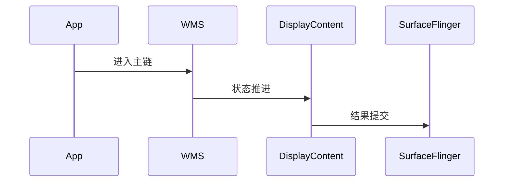

# WMS 源码分析

## 一、问题定义与范围
- 范围：WindowManagerService 与窗口容器主链完整，可完成窗口可见性、层级、焦点与 relayout 分析。
- 现状：本次输出基于目录源码静态分析，不包含运行时日志。

## 二、主调用链
- ATMS/App -> WindowManagerService -> WindowState/DisplayContent -> Surface placement -> SurfaceFlinger
- 关键边界：重点关注 system_server、Binder、BufferQueue、SurfaceFlinger 等跨线程/跨进程收敛点。

## 三、设计思想与架构权衡
- WMS 用树形 WindowContainer 统一表达层级、焦点和配置变化，代价是状态收敛点较多。

## 四、架构图（Mermaid）

## 五、时序图（Mermaid）

## 六、关键代码详细分析
- addWindow/relayoutWindow 是应用窗口接入与首次可见的核心入口。
- performSurfacePlacementNoTrace 负责把窗口状态批量收敛为 surface 布局结果。
- 焦点、Insets、旋转等都通过 WindowContainer 树传播，适合从 DisplayContent 向下追。

## 七、证据链（源码 + 运行时）
- 源码证据：`base/services/core/java/com/android/server/wm/WindowManagerService.java`
- 运行时证据：当前目录仅含源码，无 logcat、dumpsys、Perfetto、Winscope，运行时证据未闭环。

## 八、根因结论与置信度
- 结论：当前仓库对 `aosp-wms` 的覆盖状态为 `FULL`。
- 置信度：`Highly Likely`。

## 九、修复建议
- 若用于问题定位，优先围绕上述入口继续下钻；若为仓库缺口，则先补齐缺失源码再做闭环判断。

## 十、验证计划
- 补采与本模块对应的 `logcat`、`dumpsys`、Perfetto 或 Winscope，并回到文中主链逐段比对。

## 十一、证据缺口与后续采集
- 缺口：缺少运行时证据。
- 后续：按本模块主链采集线程栈、事务、buffer、焦点或权限状态。
