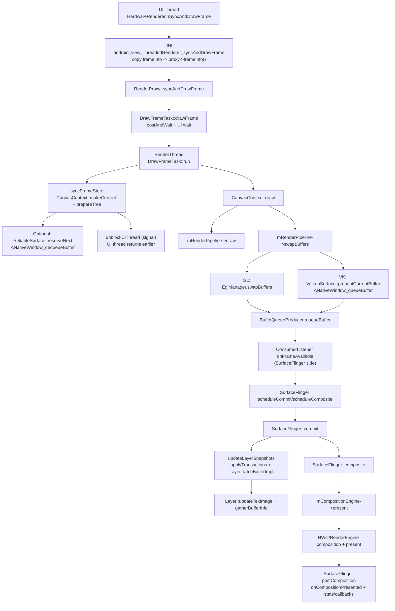

# HWUI `RenderProxy::syncAndDrawFrame()` 调用链分析（直到 SurfaceFlinger 合成结束）

本文从 `base/libs/hwui/renderthread/RenderProxy.cpp` 的 `RenderProxy::syncAndDrawFrame()` 出发，沿调用堆栈梳理 **HWUI(RenderThread) → ANativeWindow/BufferQueue → SurfaceFlinger(SF) → 合成(present) 完成** 的关键链路，并给出流程图与关键点解释。

---

## 1) 从 `RenderProxy::syncAndDrawFrame()` 开始的调用堆栈（HWUI → BufferQueue）

### 1.1 入口（Java/JNI → native）

- Java `android.graphics.HardwareRenderer.nSyncAndDrawFrame(...)`
- JNI `android_view_ThreadedRenderer_syncAndDrawFrame(...)`：
  - 把 `frameInfo[]` 拷贝进 `proxy->frameInfo()`
  - 然后调用 `proxy->syncAndDrawFrame()`
  - 文件：`base/libs/hwui/jni/android_graphics_HardwareRenderer.cpp`
- `RenderProxy::syncAndDrawFrame()` → `mDrawFrameTask.drawFrame()`
  - 文件：`base/libs/hwui/renderthread/RenderProxy.cpp`

### 1.2 UI 线程阻塞等待 RT 完成“同步阶段”

- `DrawFrameTask::drawFrame()`
  - `postAndWait()`：把 `run()` post 到 RenderThread queue，然后 UI 线程 `mSignal.wait()` 阻塞
  - 文件：`base/libs/hwui/renderthread/DrawFrameTask.cpp`

### 1.3 RenderThread（RT）上执行：同步树 + 绘制 + swap/queueBuffer

- `DrawFrameTask::run()`（RT 线程）：

1) **同步阶段**：`syncFrameState(TreeInfo::MODE_FULL)`
- `mRenderThread->timeLord().vsyncReceived(...)`
- `mContext->makeCurrent()`
- `mContext->prepareTree(info, mFrameInfo, mSyncQueued, mTargetNode)`
  - 其中在可绘制时会调用 `mNativeSurface->reserveNext()`
  - 文件：`base/libs/hwui/renderthread/CanvasContext.cpp`
  - `ReliableSurface::reserveNext()`（若启用预取）内部会触发一次 `ANativeWindow_dequeueBuffer`
    - 文件：`base/libs/hwui/renderthread/ReliableSurface.cpp`

2) **尽早解锁 UI 线程**：满足条件时 `unblockUiThread()` 先 `signal`，UI 线程从 `syncAndDrawFrame()` 返回/继续；RT 随后继续完成真正的绘制与提交。

3) **绘制阶段**：`mContext->draw(...)`（若该帧未被 skip）
- `CanvasContext::draw()` → `mRenderPipeline->draw(...)`
- `CanvasContext::draw()` → `mRenderPipeline->swapBuffers(...)`（提交 buffer 的关键点）
- 文件：`base/libs/hwui/renderthread/CanvasContext.cpp`

---

## 2) `swapBuffers()` 的两条典型路径（GL / Vulkan）

### 2.1 Skia OpenGL（EGL swap）

- `SkiaOpenGLPipeline::swapBuffers()` → `mEglManager.swapBuffers(...)`
- 文件：`base/libs/hwui/pipeline/skia/SkiaOpenGLPipeline.cpp`

> 最终由 EGL/ANativeWindow 完成 `dequeue/queueBuffer`（这部分在本仓内不完全展开，但 HWUI 明确走到 EGL swap）。

### 2.2 Skia Vulkan（路径更“显式”：dequeue/queue 在源码中可见）

- `SkiaVulkanPipeline::swapBuffers()` → `vulkanManager().swapBuffers(mVkSurface, ...)`
- `VulkanSurface::dequeueNativeBuffer()`：`mNativeWindow->dequeueBuffer(...)`（拿到 `ANativeWindowBuffer`）
- `VulkanSurface::presentCurrentBuffer()`：`mNativeWindow->queueBuffer(..., queuedFd)`（提交到 BufferQueue）
- 文件：`base/libs/hwui/renderthread/VulkanSurface.cpp`

---

## 3) BufferQueueProducer：把 BufferItem 入队并通知消费者（SurfaceFlinger）

- `BufferQueueProducer::queueBuffer(int slot, const QueueBufferInput&, QueueBufferOutput*)`
  - 把 `BufferItem` 入 `mCore->mQueue`
  - 取 `mCore->mConsumerListener` 并触发 `onFrameAvailable`
  - 文件：`native/libs/gui/BufferQueueProducer.cpp`

> 对 SF 而言，这个 `onFrameAvailable` 是“新 buffer 已经可被 latch”的核心信号之一（另一个常见驱动源是 VSYNC/HWC refresh）。

---

## 4) SurfaceFlinger：从 latch 到合成结束（commit → composite → present）

### 4.1 调度与帧驱动（触发 commit/composite）

- `SurfaceFlinger::scheduleComposite()` → `scheduleCommit()` → `mScheduler->scheduleFrame(...)`
- HWC 回调也会触发：`SurfaceFlinger::onComposerHalRefresh()` → `scheduleComposite()`
- 文件：`native/services/surfaceflinger/SurfaceFlinger.cpp`

### 4.2 Commit：应用事务 + latch buffer（从 BufferQueue 取出“最新可用 buffer”）

- `SurfaceFlinger::commit(pacesetterId, frameTargets)`
  - `updateLayerSnapshots(...)`
    - `applyTransactionsLocked(...)`
    - 对每个 layer：`Layer::latchBufferImpl(...)`
      - acquire fence 未 signal：本帧不 latch，等待下一帧重试
      - fence ok：`Layer::updateTexImage(latchTime, expectedPresentTime, ...)`
      - `Layer::gatherBufferInfo()` 更新当前 buffer 信息
  - 文件：
    - `native/services/surfaceflinger/SurfaceFlinger.cpp`
    - `native/services/surfaceflinger/Layer.cpp`

### 4.3 Composite：交给 CompositionEngine 完成合成与 present（合成结束点）

- `SurfaceFlinger::composite(pacesetterId, frameTargeters)`
  - 构造 `compositionengine::CompositionRefreshArgs`
  - 调用 `mCompositionEngine->present(mainThreadRefreshArgs)`
  - 之后进入 `postComposition` 段落：`onCompositionPresented(...)`、统计、回调、以及可能的下一帧调度
  - 文件：`native/services/surfaceflinger/SurfaceFlinger.cpp`

> `mCompositionEngine->present(...)` 内部会根据输出策略选择 **HWC(Device) 合成** 或 **RenderEngine(GPU/Client) 合成**，并在最后执行 present，产出 present fence/时间戳等；这可视为“SF 合成结束”的逻辑边界。

---

## 5) 端到端流程图（HWUI → BufferQueue → SF → 合成结束）

---

## 6) 关键点解释（看调用栈时最该抓的语义点）

- **`syncAndDrawFrame()` 的“同步”是什么？**
  - `DrawFrameTask::run()` 里会先 `syncFrameState()`（同步 RenderNode 树状态、纹理上传、准备 surface/buffer 等）
  - 满足条件后就 `signal` 解锁 UI 线程；RT 随后继续完成 `draw()` 与 `swapBuffers()`

- **`prepareTree()` 与 `reserveNext()` 的意义**
  - `prepareTree()` 做 RenderNode 树遍历、动画、dirty/damage 计算
  - 可绘制时触发 `mNativeSurface->reserveNext()`（预取路径可能提前 `dequeueBuffer`，降低关键路径阻塞概率）

- **“交给 SF”的瞬间**
  - Vulkan 路径最清晰：`VulkanSurface::presentCurrentBuffer()` 中 `mNativeWindow->queueBuffer(...)`
  - 随后 `BufferQueueProducer::queueBuffer()` 触发 consumer 侧 `onFrameAvailable`，SF 才能在后续 commit 中 latch

- **SF 的帧闭环：commit 负责 latch，composite 负责合成/present**
  - `SurfaceFlinger::commit()`：`Layer::latchBufferImpl()` 决定该 buffer 是否进入本帧合成
  - `SurfaceFlinger::composite()`：`mCompositionEngine->present()` 执行合成与 present；SF 随后 `postComposition` 收尾

