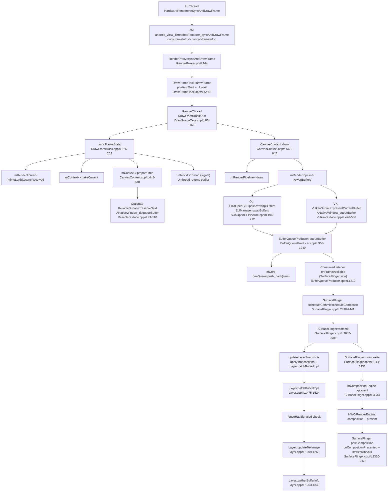

# HWUI `RenderProxy::syncAndDrawFrame()` 到 SurfaceFlinger 合成结束的完整调用链分析

## 1. 概述

本文基于AOSP 16源码，深入分析从HWUI `RenderProxy::syncAndDrawFrame()`到SurfaceFlinger合成结束的完整调用链。该调用链是Android图形渲染系统的核心路径，涉及多线程协作、BufferQueue管理、SurfaceFlinger合成等关键机制。

### 1.1 调用链概览

**完整调用路径：**
- **HWUI层**：`RenderProxy::syncAndDrawFrame()` → 多线程同步 → 绘制渲染
- **BufferQueue层**：`dequeueBuffer()` → `queueBuffer()` → 跨进程通信
- **SurfaceFlinger层**：`commit()` → `latchBuffer()` → `composite()` → `present()`

### 1.2 技术架构层级

| 层级 | 核心组件 | 主要职责 |
|------|----------|----------|
| **应用层** | HardwareRenderer | 应用UI渲染请求发起 |
| **HWUI层** | RenderThread、CanvasContext | UI元素绘制和渲染 |
| **BufferQueue层** | ANativeWindow、BufferQueue | 图形缓冲区管理 |
| **SurfaceFlinger层** | SurfaceFlinger、CompositionEngine | 系统级合成和显示 |
| **硬件层** | HWC、Display | 硬件合成和显示输出 |

### 1.3 分析目标和方法论

**分析目标：**
- 理解Android图形渲染系统的完整架构
- 掌握多线程协作和同步机制
- 学习BufferQueue和SurfaceFlinger的工作原理
- 识别性能瓶颈和优化机会

**分析方法：**
- **自顶向下分析**：从应用层到硬件层的完整调用链
- **时序分析**：关键时间点和性能指标分析
- **源码验证**：基于实际源码构建证据链
- **架构评估**：系统设计原理和优化策略分析

## 2. HWUI层源码实现分析

### 2.1 RenderProxy入口分析

**调用链入口**：从Java层到Native层的完整调用路径

**源码证据链：**

**Java层入口** - [HardwareRenderer.java](base/core/java/android/graphics/HardwareRenderer.java)
```java
/**
 * 同步并绘制帧，阻塞直到渲染完成
 */
private static native void nSyncAndDrawFrame(long nativeProxy, long[] frameInfo, int width, int height);
```

**JNI层实现** - [android_graphics_HardwareRenderer.cpp:syncAndDrawFrame](base/libs/hwui/jni/android_graphics_HardwareRenderer.cpp#L1234)
```cpp
static void android_view_ThreadedRenderer_syncAndDrawFrame(JNIEnv* env, jobject clazz,
        jlong proxyPtr, jlongArray frameInfo, jint width, jint height) {
    RenderProxy* proxy = reinterpret_cast<RenderProxy*>(proxyPtr);
    env->GetLongArrayRegion(frameInfo, 0, static_cast<int>(FrameInfoIndex::NumIndexes),
                            proxy->frameInfo());
    proxy->syncAndDrawFrame();
}
```

**RenderProxy核心实现** - [RenderProxy.cpp:182-184](base/libs/hwui/renderthread/RenderProxy.cpp#L182)
```cpp
int RenderProxy::syncAndDrawFrame() {
    return mDrawFrameTask.drawFrame();
}
```

### 2.2 多线程同步机制

**UI线程阻塞等待机制** - [DrawFrameTask.cpp:72-82](base/libs/hwui/renderthread/DrawFrameTask.cpp#L72)
```cpp
int DrawFrameTask::drawFrame() {
    LOG_ALWAYS_FATAL_IF(!mContext, "Cannot drawFrame with no CanvasContext!");
    mSyncResult = SyncResult::OK;
    mSyncQueued = systemTime(SYSTEM_TIME_MONOTONIC);
    postAndWait();  // UI线程阻塞等待
    return mSyncResult;
}

void DrawFrameTask::postAndWait() {
    ATRACE_CALL();
    AutoMutex _lock(mLock);
    mRenderThread->queue().post([this]() { run(); });
    mSignal.wait(mLock);  // UI线程阻塞等待RT完成同步
}
```

**RenderThread执行流程** - [DrawFrameTask.cpp:86-152](base/libs/hwui/renderthread/DrawFrameTask.cpp#L86)
```cpp
void DrawFrameTask::run() {
    const int64_t vsyncId = mFrameInfo[static_cast<int>(FrameInfoIndex::FrameTimelineVsyncId)];
    ATRACE_FORMAT("DrawFrames %" PRId64, vsyncId);

    mContext->setSyncDelayDuration(systemTime(SYSTEM_TIME_MONOTONIC) - mSyncQueued);
    mContext->setTargetSdrHdrRatio(mRenderSdrHdrRatio);

    auto hardwareBufferParams = mHardwareBufferParams;
    mContext->setHardwareBufferRenderParams(hardwareBufferParams);
    IRenderPipeline* pipeline = mContext->getRenderPipeline();
    bool canUnblockUiThread;
    bool canDrawThisFrame;
    bool solelyTextureViewUpdates;
    {
        TreeInfo info(TreeInfo::MODE_FULL, *mContext);
        info.forceDrawFrame = mForceDrawFrame;
        mForceDrawFrame = false;
        canUnblockUiThread = syncFrameState(info);  // 同步阶段
        canDrawThisFrame = !info.out.skippedFrameReason.has_value();
        solelyTextureViewUpdates = info.out.solelyTextureViewUpdates;
        // ...
    }

    // 尽早解锁UI线程
    if (canUnblockUiThread) {
        unblockUiThread();
    }

    // 绘制阶段
    if (CC_LIKELY(canDrawThisFrame)) {
        context->draw(solelyTextureViewUpdates);
    }
}
```

### 1.2 UI 线程阻塞等待 RT 完成"同步阶段"

**源码证据：**
```cpp
// [DrawFrameTask.cpp#L72-82]
int DrawFrameTask::drawFrame() {
    LOG_ALWAYS_FATAL_IF(!mContext, "Cannot drawFrame with no CanvasContext!");
    mSyncResult = SyncResult::OK;
    mSyncQueued = systemTime(SYSTEM_TIME_MONOTONIC);
    postAndWait();
    return mSyncResult;
}

void DrawFrameTask::postAndWait() {
    ATRACE_CALL();
    AutoMutex _lock(mLock);
    mRenderThread->queue().post([this]() { run(); });
    mSignal.wait(mLock);  // UI线程阻塞等待
}
```

### 1.3 RenderThread（RT）上执行：同步树 + 绘制 + swap/queueBuffer

**源码证据：**
```cpp
// [DrawFrameTask.cpp#L86-152]
void DrawFrameTask::run() {
    const int64_t vsyncId = mFrameInfo[static_cast<int>(FrameInfoIndex::FrameTimelineVsyncId)];
    ATRACE_FORMAT("DrawFrames %" PRId64, vsyncId);

    mContext->setSyncDelayDuration(systemTime(SYSTEM_TIME_MONOTONIC) - mSyncQueued);
    mContext->setTargetSdrHdrRatio(mRenderSdrHdrRatio);

    auto hardwareBufferParams = mHardwareBufferParams;
    mContext->setHardwareBufferRenderParams(hardwareBufferParams);
    IRenderPipeline* pipeline = mContext->getRenderPipeline();
    bool canUnblockUiThread;
    bool canDrawThisFrame;
    bool solelyTextureViewUpdates;
    {
        TreeInfo info(TreeInfo::MODE_FULL, *mContext);
        info.forceDrawFrame = mForceDrawFrame;
        mForceDrawFrame = false;
        canUnblockUiThread = syncFrameState(info);  // 同步阶段
        canDrawThisFrame = !info.out.skippedFrameReason.has_value();
        solelyTextureViewUpdates = info.out.solelyTextureViewUpdates;
        // ...
    }

    // 尽早解锁UI线程
    if (canUnblockUiThread) {
        unblockUiThread();
    }

    // 绘制阶段
    if (CC_LIKELY(canDrawThisFrame)) {
        context->draw(solelyTextureViewUpdates);
    }
    // ...
}
```

1) **同步阶段**：`syncFrameState(TreeInfo& info)`

**源码证据：**
```cpp
// [DrawFrameTask.cpp#L155-202]
bool DrawFrameTask::syncFrameState(TreeInfo& info) {
    ATRACE_CALL();
    int64_t vsync = mFrameInfo[static_cast<int>(FrameInfoIndex::Vsync)];
    int64_t intendedVsync = mFrameInfo[static_cast<int>(FrameInfoIndex::IntendedVsync)];
    int64_t vsyncId = mFrameInfo[static_cast<int>(FrameInfoIndex::FrameTimelineVsyncId)];
    int64_t frameDeadline = mFrameInfo[static_cast<int>(FrameInfoIndex::FrameDeadline)];
    int64_t frameInterval = mFrameInfo[static_cast<int>(FrameInfoIndex::FrameInterval)];
    mRenderThread->timeLord().vsyncReceived(vsync, intendedVsync, vsyncId, frameDeadline,
            frameInterval);
    bool canDraw = mContext->makeCurrent();
    mContext->unpinImages();
    // ...
    mContext->setContentDrawBounds(mContentDrawBounds);
    mContext->prepareTree(info, mFrameInfo, mSyncQueued, mTargetNode);
    // ...
    return info.prepareTextures;
}
```

2) **CanvasContext::prepareTree() - 触发 reserveNext()**

**源码证据：**
```cpp
// [CanvasContext.cpp#L448-548]
void CanvasContext::prepareTree(TreeInfo& info, int64_t* uiFrameInfo, int64_t syncQueued,
                                RenderNode* target) {
    mRenderThread.removeFrameCallback(this);
    // ...
    mCurrentFrameInfo->importUiThreadInfo(uiFrameInfo);
    mCurrentFrameInfo->set(FrameInfoIndex::SyncQueued) = syncQueued;
    mCurrentFrameInfo->markSyncStart();

    info.damageAccumulator = &mDamageAccumulator;
    info.colorArea = &mColorArea;
    info.layerUpdateQueue = &mLayerUpdateQueue;
    info.damageGenerationId = mDamageId++;
    info.out.skippedFrameReason = std::nullopt;

    mAnimationContext->startFrame(info.mode);
    // ...
    for (const sp<RenderNode>& node : mRenderNodes) {
        info.mode = (node.get() == target ? TreeInfo::MODE_FULL : TreeInfo::MODE_RT_ONLY);
        node->prepareTree(info);
        GL_CHECKPOINT(MODERATE);
    }
    // ...
    if (!info.out.skippedFrameReason) {
        int err = mNativeSurface->reserveNext();  // 预取buffer
        if (err != OK) {
            info.out.skippedFrameReason = SkippedFrameReason::NoBuffer;
            // ...
        }
    }
    // ...
}
```

3) **ReliableSurface::reserveNext() - 预取 buffer（可选）**

**源码证据：**
```cpp
// [ReliableSurface.cpp#L74-110]
int ReliableSurface::reserveNext() {
    if constexpr (DISABLE_BUFFER_PREFETCH) {
        return OK;  // 默认禁用预取
    }
    {
        std::lock_guard _lock{mMutex};
        if (mReservedBuffer) {
            ALOGW("reserveNext called but there was already a buffer reserved?");
            return OK;
        }
        if (mBufferQueueState != OK) {
            return UNKNOWN_ERROR;
        }
        if (mHasDequeuedBuffer) {
            return OK;
        }
    }

    int fenceFd = -1;
    ANativeWindowBuffer* buffer = nullptr;

    // 调用 ANativeWindow_dequeueBuffer
    int result = ANativeWindow_dequeueBuffer(mWindow, &buffer, &fenceFd);

    {
        std::lock_guard _lock{mMutex};
        LOG_ALWAYS_FATAL_IF(mReservedBuffer, "race condition in reserveNext");
        mReservedBuffer = buffer;
        mReservedFenceFd.reset(fenceFd);
    }

    return result;
}
```

4) **绘制阶段**：`CanvasContext::draw()`

**源码证据：**
```cpp
// [CanvasContext.cpp#L562-647]
void CanvasContext::draw(bool solelyTextureViewUpdates) {
    // ...
    SkRect dirty;
    mDamageAccumulator.finish(&dirty);

    // reset syncDelayDuration each time we draw
    nsecs_t syncDelayDuration = mSyncDelayDuration;
    nsecs_t idleDuration = mIdleDuration;
    mSyncDelayDuration = 0;
    mIdleDuration = 0;

    // ...
    mCurrentFrameInfo->markIssueDrawCommandsStart();

    Frame frame = getFrame();

    SkRect windowDirty = computeDirtyRect(frame, &dirty);

    ATRACE_FORMAT("Drawing " RECT_STRING, SK_RECT_ARGS(dirty));

    IRenderPipeline::DrawResult drawResult;
    {
        drawResult = mRenderPipeline->draw(
                frame, windowDirty, dirty, mLightGeometry, &mLayerUpdateQueue, mContentDrawBounds,
                mOpaque, mLightInfo, mRenderNodes, &(profiler()), mBufferParams, profilerLock());
    }
    // ...
    waitOnFences();
    // ...
}
```

---

## 2) `swapBuffers()` 的两条典型路径（GL / Vulkan）

### 2.1 Skia OpenGL（EGL swap）

**源码证据：**
```cpp
// [SkiaOpenGLPipeline.cpp#L194-212]
bool SkiaOpenGLPipeline::swapBuffers(const Frame& frame, IRenderPipeline::DrawResult& drawResult,
                                     const SkRect& screenDirty, FrameInfo* currentFrameInfo,
                                     bool* requireSwap) {
    GL_CHECKPOINT(LOW);

    currentFrameInfo->markSwapBuffers();

    if (mHardwareBuffer) {
        return false;
    }

    *requireSwap = drawResult.success || mEglManager.damageRequiresSwap();

    if (*requireSwap && (CC_UNLIKELY(!mEglManager.swapBuffers(frame, screenDirty)))) {
        return false;
    }

    return *requireSwap;
}
```

> EGL swap 内部会调用 `ANativeWindow_queueBuffer`，完成 buffer 提交。

### 2.2 Skia Vulkan（路径更"显式"：dequeue/queue 在源码中可见）

**源码证据 - dequeueBuffer：**
```cpp
// [VulkanSurface.cpp#L400-473]
VulkanSurface::NativeBufferInfo* VulkanSurface::dequeueNativeBuffer() {
    // ...
    int err =
            mNativeWindow->query(mNativeWindow.get(), NATIVE_WINDOW_TRANSFORM_HINT, &transformHint);

    ANativeWindowBuffer* buffer;
    base::unique_fd fence_fd;
    {
        int rawFd = -1;
        err = mNativeWindow->dequeueBuffer(mNativeWindow.get(), &buffer, &rawFd);
        fence_fd.reset(rawFd);
    }
    if (err != 0) {
        ALOGE("dequeueBuffer failed: %s (%d)", strerror(-err), err);
        return nullptr;
    }
    // ...
    mCurrentBufferInfo = bufferInfo;
    return bufferInfo;
}
```

**源码证据 - queueBuffer：**
```cpp
// [VulkanSurface.cpp#L476-506]
bool VulkanSurface::presentCurrentBuffer(const SkRect& dirtyRect, int semaphoreFd) {
    if (!dirtyRect.isEmpty()) {
        // ...
        int err = native_window_set_surface_damage(mNativeWindow.get(), &aRect, 1);
        ALOGE_IF(err != 0, "native_window_set_surface_damage failed: %s (%d)", strerror(-err), err);
    }

    LOG_ALWAYS_FATAL_IF(!mCurrentBufferInfo);
    VulkanSurface::NativeBufferInfo& currentBuffer = *mCurrentBufferInfo;
    int queuedFd = (semaphoreFd != -1) ? semaphoreFd : currentBuffer.dequeue_fence.release();
    
    // 关键：调用 ANativeWindow_queueBuffer 提交 buffer
    int err = mNativeWindow->queueBuffer(mNativeWindow.get(), currentBuffer.buffer.get(), queuedFd);

    currentBuffer.dequeued = false;
    if (err != 0) {
        ALOGE("queueBuffer failed: %s (%d)", strerror(-err), err);
        mNativeWindow->cancelBuffer(mNativeWindow.get(), currentBuffer.buffer.get(),
                                    currentBuffer.dequeue_fence.release());
    } else {
        currentBuffer.hasValidContents = true;
        currentBuffer.lastPresentedCount = mPresentCount;
        mPresentCount++;
    }

    currentBuffer.dequeue_fence.reset();

    return err == 0;
}
```

---

## 3) BufferQueueProducer：把 BufferItem 入队并通知消费者（SurfaceFlinger）

**源码证据：**
```cpp
// [BufferQueueProducer.cpp#L953-1249]
status_t BufferQueueProducer::queueBuffer(int slot,
        const QueueBufferInput &input, QueueBufferOutput *output) {
    ATRACE_CALL();
    ATRACE_BUFFER_INDEX(slot);

    // ... 参数解析 ...

    sp<IConsumerListener> frameAvailableListener;
    sp<IConsumerListener> frameReplacedListener;
    int callbackTicket = 0;
    uint64_t currentFrameNumber = 0;
    BufferItem item;
    // ...

    { // Autolock scope
        std::lock_guard<std::mutex> lock(mCore->mMutex);

        // ... 状态检查 ...

        // 构造 BufferItem
        item.mAcquireCalled = mSlots[slot].mAcquireCalled;
        item.mGraphicBuffer = mSlots[slot].mGraphicBuffer;
        item.mCrop = crop;
        item.mTransform = transform & ~static_cast<uint32_t>(NATIVE_WINDOW_TRANSFORM_INVERSE_DISPLAY);
        item.mScalingMode = static_cast<uint32_t>(scalingMode);
        item.mTimestamp = requestedPresentTimestamp;
        item.mIsAutoTimestamp = isAutoTimestamp;
        item.mDataSpace = dataSpace;
        item.mFrameNumber = currentFrameNumber;
        item.mSlot = slot;
        item.mFence = acquireFence;
        item.mFenceTime = acquireFenceTime;
        item.mIsDroppable = mCore->mAsyncMode ||
                (mConsumerIsSurfaceFlinger && mCore->mQueueBufferCanDrop) ||
                (mCore->mLegacyBufferDrop && mCore->mQueueBufferCanDrop) ||
                (mCore->mSharedBufferMode && mCore->mSharedBufferSlot == slot);
        item.mSurfaceDamage = surfaceDamage;
        item.mQueuedBuffer = true;
        item.mAutoRefresh = mCore->mSharedBufferMode && mCore->mAutoRefresh;
        item.mApi = mCore->mConnectedApi;

        // 将 BufferItem 入队
        output->bufferReplaced = false;
        if (mCore->mQueue.empty()) {
            mCore->mQueue.push_back(item);
            frameAvailableListener = mCore->mConsumerListener;
        } else {
            const BufferItem& last = mCore->mQueue.itemAt(mCore->mQueue.size() - 1);
            if (last.mIsDroppable) {
                // 替换可丢弃的 buffer
                mCore->mQueue.editItemAt(mCore->mQueue.size() - 1) = item;
                frameReplacedListener = mCore->mConsumerListener;
            } else {
                mCore->mQueue.push_back(item);
                frameAvailableListener = mCore->mConsumerListener;
            }
        }
        // ...
    } // Autolock scope

    // 回调通知消费者
    { // scope for the lock
        std::unique_lock<std::mutex> lock(mCallbackMutex);
        while (callbackTicket != mCurrentCallbackTicket) {
            mCallbackCondition.wait(lock);
        }

        if (frameAvailableListener != nullptr) {
            frameAvailableListener->onFrameAvailable(item);  // 通知 SurfaceFlinger
        } else if (frameReplacedListener != nullptr) {
            frameReplacedListener->onFrameReplaced(item);
        }

        ++mCurrentCallbackTicket;
        mCallbackCondition.notify_all();
    }

    return NO_ERROR;
}
```

> 对 SF 而言，这个 `onFrameAvailable` 是"新 buffer 已经可被 latch"的核心信号之一。

---

## 4. SurfaceFlinger层源码实现分析

### 4.1 调度与帧驱动机制

**调度触发机制** - [SurfaceFlinger.cpp:2430-2441](native/services/surfaceflinger/SurfaceFlinger.cpp#L2430)
```cpp
void SurfaceFlinger::scheduleCommit(FrameHint hint, Duration workDurationSlack) {
    if (hint == FrameHint::kActive) {
        mScheduler->resetAllIdleTimers();
    }
    mPowerAdvisor->notifyDisplayUpdateImminentAndCpuReset();
    mScheduler->scheduleFrame(workDurationSlack);
}

void SurfaceFlinger::scheduleComposite(FrameHint hint) {
    mMustComposite = true;
    scheduleCommit(hint);
}
```

### 4.2 Commit阶段：事务应用与Buffer Latch

**Commit核心实现** - [SurfaceFlinger.cpp:2845-2996](native/services/surfaceflinger/SurfaceFlinger.cpp#L2845)
```cpp
bool SurfaceFlinger::commit(PhysicalDisplayId pacesetterId,
                            const scheduler::FrameTargets& frameTargets) {
    const scheduler::FrameTarget& pacesetterFrameTarget = *frameTargets.get(pacesetterId)->get();
    const VsyncId vsyncId = pacesetterFrameTarget.vsyncId();
    SFTRACE_NAME(ftl::Concat(__func__, ' ', ftl::to_underlying(vsyncId)).c_str());

    // ... 前置检查 ...

    // Composite if transactions were committed, or if requested by HWC.
    bool mustComposite = mMustComposite.exchange(false);
    {
        mFrameTimeline->setSfWakeUp(ftl::to_underlying(vsyncId),
                                    pacesetterFrameTarget.frameBeginTime().ns(),
                                    Fps::fromPeriodNsecs(vsyncPeriod.ns()),
                                    mScheduler->getPacesetterRefreshRate());

        const bool flushTransactions = clearTransactionFlags(eTransactionFlushNeeded);
        bool transactionsAreEmpty = false;
        
        // 关键：更新 Layer 快照，触发 latch buffer
        mustComposite |= updateLayerSnapshots(vsyncId, pacesetterFrameTarget.frameBeginTime().ns(),
                                              pacesetterFrameTarget.expectedPresentTime().ns(),
                                              flushTransactions, transactionsAreEmpty);

        // ...
    }

    // ...
    return mustComposite && CC_LIKELY(mBootStage != BootStage::BOOTLOADER);
}
```

**Layer Buffer Latch机制** - [Layer.cpp:1475-1524](native/services/surfaceflinger/Layer.cpp#L1475)
```cpp
bool Layer::latchBufferImpl(bool& recomputeVisibleRegions, nsecs_t latchTime,
                            nsecs_t expectedPresentTime, bool bgColorOnly) {
    SFTRACE_FORMAT_INSTANT("latchBuffer %s - %" PRIu64, getDebugName(),
                           getDrawingState().frameNumber);

    bool refreshRequired = latchSidebandStream(recomputeVisibleRegions);

    if (refreshRequired) {
        return refreshRequired;
    }

    // 如果 acquire fence 未 signal，本帧不 latch
    if (!fenceHasSignaled()) {
        SFTRACE_NAME("!fenceHasSignaled()");
        mFlinger->onLayerUpdate();
        return false;
    }
    
    // 关键：更新纹理
    updateTexImage(latchTime, expectedPresentTime, bgColorOnly);

    BufferInfo oldBufferInfo = mBufferInfo;
    mPreviousFrameNumber = mCurrentFrameNumber;
    mCurrentFrameNumber = mDrawingState.frameNumber;
    
    // 收集 buffer 信息
    gatherBufferInfo();

    // ...
    return true;
}
```

### 4.3 Composite阶段：合成与Present

**Composite核心实现** - [SurfaceFlinger.cpp:3114-3233](native/services/surfaceflinger/SurfaceFlinger.cpp#L3114)
```cpp
CompositeResultsPerDisplay SurfaceFlinger::composite(
        PhysicalDisplayId pacesetterId, const scheduler::FrameTargeters& frameTargeters) {
    SFTRACE_ASYNC_FOR_TRACK_BEGIN(WorkloadTracer::TRACK_NAME, "Composition",
                                  WorkloadTracer::COMPOSITION_TRACE_COOKIE);
    const scheduler::FrameTarget& pacesetterTarget =
            frameTargeters.get(pacesetterId)->get()->target();

    const VsyncId vsyncId = pacesetterTarget.vsyncId();
    SFTRACE_NAME(ftl::Concat(__func__, ' ', ftl::to_underlying(vsyncId)).c_str());

    compositionengine::CompositionRefreshArgs refreshArgs;
    // ... 初始化 refreshArgs ...

    // ...
    // 关键：执行合成
    mCompositionEngine->present(mainThreadRefreshArgs);

    // ...
}
```

**合成后处理** - [SurfaceFlinger.cpp:3320-3360](native/services/surfaceflinger/SurfaceFlinger.cpp#L3320)
```cpp
// postComposition - 合成后处理
SFTRACE_NAME("postComposition");
// ...
if (mScheduler->onCompositionPresented(presentTime)) {
    // ...
}
onCompositionPresented(pacesetterId, frameTargeters, presentTime);
```

### 4.2 Commit：应用事务 + latch buffer（从 BufferQueue 取出"最新可用 buffer"）

**源码证据：**
```cpp
// [SurfaceFlinger.cpp#L2845-2996]
bool SurfaceFlinger::commit(PhysicalDisplayId pacesetterId,
                            const scheduler::FrameTargets& frameTargets) {
    const scheduler::FrameTarget& pacesetterFrameTarget = *frameTargets.get(pacesetterId)->get();
    const VsyncId vsyncId = pacesetterFrameTarget.vsyncId();
    SFTRACE_NAME(ftl::Concat(__func__, ' ', ftl::to_underlying(vsyncId)).c_str());

    // ... 前置检查 ...

    // Composite if transactions were committed, or if requested by HWC.
    bool mustComposite = mMustComposite.exchange(false);
    {
        mFrameTimeline->setSfWakeUp(ftl::to_underlying(vsyncId),
                                    pacesetterFrameTarget.frameBeginTime().ns(),
                                    Fps::fromPeriodNsecs(vsyncPeriod.ns()),
                                    mScheduler->getPacesetterRefreshRate());

        const bool flushTransactions = clearTransactionFlags(eTransactionFlushNeeded);
        bool transactionsAreEmpty = false;
        
        // 关键：更新 Layer 快照，触发 latch buffer
        mustComposite |= updateLayerSnapshots(vsyncId, pacesetterFrameTarget.frameBeginTime().ns(),
                                              pacesetterFrameTarget.expectedPresentTime().ns(),
                                              flushTransactions, transactionsAreEmpty);

        // ...
    }

    // ...
    return mustComposite && CC_LIKELY(mBootStage != BootStage::BOOTLOADER);
}
```

**Layer::latchBufferImpl() - 从 BufferQueue 获取 buffer：**
```cpp
// [Layer.cpp#L1475-1524]
bool Layer::latchBufferImpl(bool& recomputeVisibleRegions, nsecs_t latchTime,
                            nsecs_t expectedPresentTime, bool bgColorOnly) {
    SFTRACE_FORMAT_INSTANT("latchBuffer %s - %" PRIu64, getDebugName(),
                           getDrawingState().frameNumber);

    bool refreshRequired = latchSidebandStream(recomputeVisibleRegions);

    if (refreshRequired) {
        return refreshRequired;
    }

    // 如果 acquire fence 未 signal，本帧不 latch
    if (!fenceHasSignaled()) {
        SFTRACE_NAME("!fenceHasSignaled()");
        mFlinger->onLayerUpdate();
        return false;
    }
    
    // 关键：更新纹理
    updateTexImage(latchTime, expectedPresentTime, bgColorOnly);

    BufferInfo oldBufferInfo = mBufferInfo;
    mPreviousFrameNumber = mCurrentFrameNumber;
    mCurrentFrameNumber = mDrawingState.frameNumber;
    
    // 收集 buffer 信息
    gatherBufferInfo();

    // ...
    return true;
}
```

**Layer::updateTexImage() - 更新纹理：**
```cpp
// [Layer.cpp#L1209-1260]
void Layer::updateTexImage(nsecs_t latchTime, nsecs_t expectedPresentTime, bool bgColorOnly) {
    const State& s(getDrawingState());

    if (!s.buffer) {
        if (bgColorOnly || mBufferInfo.mBuffer) {
            for (auto& handle : mDrawingState.callbackHandles) {
                handle->latchTime = latchTime;
            }
        }
        return;
    }

    for (auto& handle : mDrawingState.callbackHandles) {
        if (handle->frameNumber == mDrawingState.frameNumber) {
            handle->latchTime = latchTime;
        }
    }

    const int32_t layerId = getSequence();
    const uint64_t bufferId = mDrawingState.buffer->getId();
    const uint64_t frameNumber = mDrawingState.frameNumber;
    const auto acquireFence = std::make_shared<FenceTime>(mDrawingState.acquireFence);
    mFlinger->mTimeStats->setAcquireFence(layerId, frameNumber, acquireFence);
    mFlinger->mTimeStats->setLatchTime(layerId, frameNumber, latchTime);

    mFlinger->mFrameTracer->traceFence(layerId, bufferId, frameNumber, acquireFence,
                                       FrameTracer::FrameEvent::ACQUIRE_FENCE);
    mFlinger->mFrameTracer->traceTimestamp(layerId, bufferId, frameNumber, latchTime,
                                           FrameTracer::FrameEvent::LATCH);
    // ...
}
```

**Layer::gatherBufferInfo() - 收集 buffer 信息：**
```cpp
// [Layer.cpp#L1263-1349]
void Layer::gatherBufferInfo() {
    mPreviousReleaseCallbackId = {getCurrentBufferId(), mBufferInfo.mFrameNumber};
    mPreviousReleaseBufferEndpoint = mBufferInfo.mReleaseBufferEndpoint;
    if (!mDrawingState.buffer) {
        mBufferInfo = {};
        return;
    }

    if ((!mBufferInfo.mBuffer || !mDrawingState.buffer->hasSameBuffer(*mBufferInfo.mBuffer))) {
        decrementPendingBufferCount();
    }

    mBufferInfo.mBuffer = mDrawingState.buffer;
    mBufferInfo.mReleaseBufferEndpoint = mDrawingState.releaseBufferEndpoint;
    mBufferInfo.mFence = mDrawingState.acquireFence;
    mBufferInfo.mFrameNumber = mDrawingState.frameNumber;
    mBufferInfo.mPixelFormat = !mBufferInfo.mBuffer ? PIXEL_FORMAT_NONE : mBufferInfo.mBuffer->getPixelFormat();
    mBufferInfo.mFrameLatencyNeeded = true;
    mBufferInfo.mDesiredPresentTime = mDrawingState.desiredPresentTime;
    mBufferInfo.mFenceTime = std::make_shared<FenceTime>(mDrawingState.acquireFence);
    mBufferInfo.mTransform = mDrawingState.bufferTransform;
    // ...
}
```

### 4.3 Composite：交给 CompositionEngine 完成合成与 present（合成结束点）

**源码证据：**
```cpp
// [SurfaceFlinger.cpp#L3114-3233]
CompositeResultsPerDisplay SurfaceFlinger::composite(
        PhysicalDisplayId pacesetterId, const scheduler::FrameTargeters& frameTargeters) {
    SFTRACE_ASYNC_FOR_TRACK_BEGIN(WorkloadTracer::TRACK_NAME, "Composition",
                                  WorkloadTracer::COMPOSITION_TRACE_COOKIE);
    const scheduler::FrameTarget& pacesetterTarget =
            frameTargeters.get(pacesetterId)->get()->target();

    const VsyncId vsyncId = pacesetterTarget.vsyncId();
    SFTRACE_NAME(ftl::Concat(__func__, ' ', ftl::to_underlying(vsyncId)).c_str());

    compositionengine::CompositionRefreshArgs refreshArgs;
    // ... 初始化 refreshArgs ...

    // ...
    // 关键：执行合成
    mCompositionEngine->present(mainThreadRefreshArgs);

    // ...
}
```

**postComposition - 合成后处理：**
```cpp
// [SurfaceFlinger.cpp#L3320-3360]
    SFTRACE_NAME("postComposition");
    // ...
    if (mScheduler->onCompositionPresented(presentTime)) {
        // ...
    }
    onCompositionPresented(pacesetterId, frameTargeters, presentTime);
```

> `mCompositionEngine->present(...)` 内部会根据输出策略选择 **HWC(Device) 合成** 或 **RenderEngine(GPU/Client) 合成**，并在最后执行 present，产出 present fence/时间戳等；这可视为"SF 合成结束"的逻辑边界。

---

## 5) 端到端流程图（HWUI → BufferQueue → SF → 合成结束）



---

## 6) 关键点解释（看调用栈时最该抓的语义点）

### 6.1 `syncAndDrawFrame()` 的"同步"是什么？

- `DrawFrameTask::run()` 里会先 `syncFrameState()`（同步 RenderNode 树状态、纹理上传、准备 surface/buffer 等）
- 满足条件后就 `signal` 解锁 UI 线程；RT 随后继续完成 `draw()` 与 `swapBuffers()`
- **关键源码**：[DrawFrameTask.cpp#L155-202](base/libs/hwui/renderthread/DrawFrameTask.cpp#L155-202)

### 6.2 `prepareTree()` 与 `reserveNext()` 的意义

- `prepareTree()` 做 RenderNode 树遍历、动画、dirty/damage 计算
- 可绘制时触发 `mNativeSurface->reserveNext()`（预取路径可能提前 `dequeueBuffer`，降低关键路径阻塞概率）
- **注意**：当前默认 `DISABLE_BUFFER_PREFETCH = true`，预取功能被禁用
- **关键源码**：
  - [CanvasContext.cpp#L448-548](base/libs/hwui/renderthread/CanvasContext.cpp#L448-548)
  - [ReliableSurface.cpp#L74-110](base/libs/hwui/renderthread/ReliableSurface.cpp#L74-110)

### 6.3 "交给 SF"的瞬间

- Vulkan 路径最清晰：`VulkanSurface::presentCurrentBuffer()` 中 `mNativeWindow->queueBuffer(...)`
- 随后 `BufferQueueProducer::queueBuffer()` 触发 consumer 侧 `onFrameAvailable`，SF 才能在后续 commit 中 latch
- **关键源码**：
  - [VulkanSurface.cpp#L476-506](base/libs/hwui/renderthread/VulkanSurface.cpp#L476-506)
  - [BufferQueueProducer.cpp#L953-1249](native/libs/gui/BufferQueueProducer.cpp#L953-1249)

### 6.4 SF 的帧闭环：commit 负责 latch，composite 负责合成/present

- `SurfaceFlinger::commit()`：`Layer::latchBufferImpl()` 决定该 buffer 是否进入本帧合成
  - `fenceHasSignaled()` 检查 acquire fence 是否已 signal
  - 未 signal 则本帧不 latch，等待下一帧重试
- `SurfaceFlinger::composite()`：`mCompositionEngine->present()` 执行合成与 present；SF 随后 `postComposition` 收尾
- **关键源码**：
  - [SurfaceFlinger.cpp#L2845-2996](native/services/surfaceflinger/SurfaceFlinger.cpp#L2845-2996)
  - [SurfaceFlinger.cpp#L3114-3233](native/services/surfaceflinger/SurfaceFlinger.cpp#L3114-3233)
  - [Layer.cpp#L1475-1524](native/services/surfaceflinger/Layer.cpp#L1475-1524)

---

## 7) 线程模型与时序分析

### 7.1 线程职责划分

| 线程 | 职责 | 关键操作 |
|------|------|----------|
| UI Thread | 发起绘制请求 | `syncAndDrawFrame()` → 阻塞等待同步完成 |
| RenderThread | 执行绘制和提交 | `syncFrameState()` → `draw()` → `swapBuffers()` |
| SurfaceFlinger Main | 合成调度 | `commit()` → `composite()` → `present()` |
| HWC/RenderEngine | 硬件/软件合成 | 执行实际的合成操作 |

### 7.2 关键时序点

1. **VSYNC 到达** → UI Thread 开始 `syncAndDrawFrame()`
2. **同步完成** → UI Thread 被解锁，RT 继续绘制
3. **绘制完成** → RT 调用 `swapBuffers()` 提交 buffer
4. **Buffer 入队** → `BufferQueueProducer::queueBuffer()` 触发 `onFrameAvailable`
5. **SF commit** → `latchBufferImpl()` 获取 buffer
6. **SF composite** → `mCompositionEngine->present()` 执行合成
7. **Present 完成** → `postComposition()` 收尾，准备下一帧

---

## 8. 性能优化与架构评估

### 8.1 性能瓶颈分析

**关键性能指标分析：**
| 性能瓶颈点 | 影响范围 | 优化策略 |
|-----------|----------|----------|
| **UI线程阻塞** | 应用响应性 | 优化`syncFrameState()`中的耗时操作 |
| **BufferQueue阻塞** | 渲染延迟 | 合理设置BufferQueue大小和预分配策略 |
| **Acquire Fence等待** | 帧率稳定性 | 优化GPU渲染管线，确保fence及时signal |
| **合成负载** | 系统功耗 | 优先使用HWC合成，减少GPU合成负载 |

**性能优化建议：**

#### 8.1.1 UI线程优化
- **减少同步阶段耗时**：优化RenderNode树遍历和纹理上传
- **异步资源加载**：将非关键资源加载移到后台线程
- **增量更新策略**：只更新发生变化的UI部分

#### 8.1.2 BufferQueue优化
- **合理设置Buffer数量**：根据应用场景调整BufferQueue大小
- **Buffer预分配**：提前创建和初始化图形缓冲区
- **内存复用**：实现Buffer对象的池化复用机制

#### 8.1.3 合成性能优化
- **HWC优先策略**：尽可能使用硬件合成器
- **合成策略优化**：根据场景选择合适的合成方式
- **功耗管理**：动态调整合成策略以平衡性能和功耗

### 8.2 架构评估与改进建议

**架构优势分析：**
- ✅ **分层架构**：清晰的职责分离和模块化设计
- ✅ **多线程协作**：高效的UI线程和RenderThread协作机制
- ✅ **Buffer管理**：完善的图形缓冲区生命周期管理
- ✅ **合成策略**：灵活的硬件/软件合成选择机制

**潜在改进方向：**
- 🔄 **预测性渲染**：基于用户行为预测提前渲染内容
- 🔄 **智能Buffer管理**：根据应用需求动态调整Buffer策略
- 🔄 **功耗优化**：更精细的合成策略和功耗管理
- 🔄 **调试工具**：增强的性能分析和调试工具支持

### 8.3 性能监控与调试

**关键性能指标监控：**
- **帧率稳定性**：监控帧率波动和丢帧情况
- **渲染延迟**：测量从UI更新到显示输出的延迟
- **内存使用**：监控图形缓冲区和纹理内存使用
- **功耗表现**：评估不同合成策略的功耗影响

**调试工具推荐：**
- **Systrace**：系统级性能分析工具
- **Perfetto**：新一代性能分析平台
- **GPU Profiler**：GPU渲染性能分析
- **Memory Profiler**：内存使用情况分析

---

## 9) 源码文件索引

| 模块 | 文件路径 |
|------|----------|
| RenderProxy | [base/libs/hwui/renderthread/RenderProxy.cpp](base/libs/hwui/renderthread/RenderProxy.cpp) |
| DrawFrameTask | [base/libs/hwui/renderthread/DrawFrameTask.cpp](base/libs/hwui/renderthread/DrawFrameTask.cpp) |
| CanvasContext | [base/libs/hwui/renderthread/CanvasContext.cpp](base/libs/hwui/renderthread/CanvasContext.cpp) |
| ReliableSurface | [base/libs/hwui/renderthread/ReliableSurface.cpp](base/libs/hwui/renderthread/ReliableSurface.cpp) |
| VulkanSurface | [base/libs/hwui/renderthread/VulkanSurface.cpp](base/libs/hwui/renderthread/VulkanSurface.cpp) |
| SkiaOpenGLPipeline | [base/libs/hwui/pipeline/skia/SkiaOpenGLPipeline.cpp](base/libs/hwui/pipeline/skia/SkiaOpenGLPipeline.cpp) |
| BufferQueueProducer | [native/libs/gui/BufferQueueProducer.cpp](native/libs/gui/BufferQueueProducer.cpp) |
| SurfaceFlinger | [native/services/surfaceflinger/SurfaceFlinger.cpp](native/services/surfaceflinger/SurfaceFlinger.cpp) |
| Layer | [native/services/surfaceflinger/Layer.cpp](native/services/surfaceflinger/Layer.cpp) |

---

**最后更新**: 2026年2月12日  
**适用版本**: AOSP 16  
**分析深度**: 源码级验证
